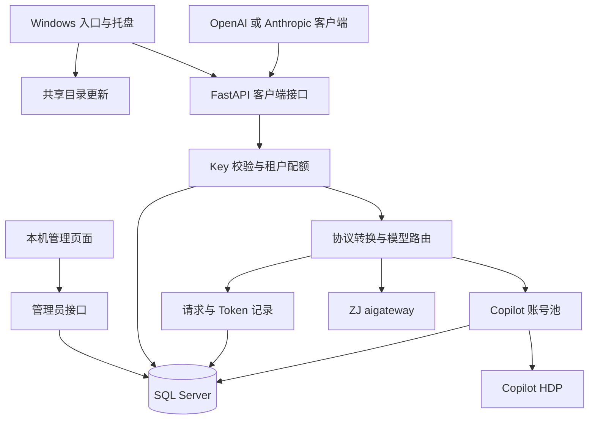

# LLM API Gateway 开发文档

LLM API Gateway 将内部 Copilot HDP 与 ZJ aigateway 统一为 OpenAI Chat Completions 和 Anthropic Messages 兼容接口。客户端通过 API Key 关联租户，网关执行模型权限与请求配额检查，再转发到对应上游；管理员通过本机 Web 界面管理共享数据。程序面向 Windows 桌面运行，提供托盘、单实例保护和共享目录更新。

本文档依据当前工作区源码编写，运行版本为 `2.7.0`，定义于 [backend/__init__.py](../backend/__init__.py)。Python 项目元数据和前端包版本仍为 `1.0.0`，不参与应用更新版本比较。

> [!NOTE]
> 文档描述当前实现，示例中的账号、密钥、服务地址均为示意值。标为“当前限制”的内容来自源码分析，不代表已修复或经过真实上游联调。

## 功能索引

| 功能文档 | 职责 | 主要源码 |
| --- | --- | --- |
| [OpenAI 对话代理](./openai_chat.md) | Chat Completions、SSE 转发、错误处理 | [server.py](../backend/server.py)、[proxy_core.py](../backend/proxy_core.py) |
| [Anthropic 消息兼容](./anthropic_messages.md) | Messages 请求转换、thinking、流式事件 | [proxy_core.py](../backend/proxy_core.py) |
| [工具调用转换](./tool_calling.md) | tool_use、tool_result、function calling | [proxy_core.py](../backend/proxy_core.py) |
| [模型发现与上游路由](./model_routing.md) | 模型目录、提供商映射、IAM 缓存与上游请求头 | [config.py](../backend/config.py)、[proxy_core.py](../backend/proxy_core.py) |
| [账号池与健康管理](./account_pool.md) | 负载分配、在飞计数、降级与恢复 | [db.py](../backend/db.py)、[server.py](../backend/server.py) |
| [API Key 鉴权与管理](./api_key_management.md) | Key 验证、创建、吊销、轮换 | [server.py](../backend/server.py)、[admin_api.py](../backend/admin_api.py) |
| [租户与配额管理](./tenant_management.md) | 租户 CRUD、模型白名单、小时配额 | [db.py](../backend/db.py)、[admin_api.py](../backend/admin_api.py) |
| [管理员访问控制](./admin_access.md) | 本机访问校验、管理员名单、首次授权 | [admin_api.py](../backend/admin_api.py) |
| [Token 用量统计](./token_usage.md) | 用户与租户汇总、模型筛选、计量边界 | [db.py](../backend/db.py) |
| [Web 管理界面](./admin_console.md) | Vue 页面、组件状态、开发代理与静态托管 | [App.vue](../frontend/src/App.vue) |
| [健康检查与可观测性](./observability.md) | 服务信息、状态概览、日志与保留策略 | [server.py](../backend/server.py)、[config.py](../backend/config.py) |
| [数据库初始化与持久化](./database.md) | SQL Server、表关系、事务、种子数据与迁移 | [db.py](../backend/db.py) |
| [配置、启动与打包](./runtime.md) | 环境变量、开发流程、托盘、单实例、构建发布 | [main.py](../backend/main.py)、[copilot_proxy.spec](../copilot_proxy.spec) |
| [自动更新](./auto_update.md) | 版本比较、下载、替换、重启及恢复边界 | [updater.py](../backend/updater.py) |

## 技术栈与全局架构

| 层次 | 当前技术 | 说明 |
| --- | --- | --- |
| Python 运行时 | Python `>=3.13`、uv | [.python-version](../.python-version) 指定 3.13 |
| HTTP 服务 | FastAPI `>=0.115.12`、Uvicorn `>=0.30.6` | 默认监听 `127.0.0.1:9899` |
| 上游请求 | HTTPX `>=0.27.2` | 异步 HTTP 与 SSE；每次请求创建客户端 |
| 数据持久化 | SQL Server、pyodbc `>=5.2`、ODBC 17/18 | 各网关进程共享账号、租户和用量数据 |
| 管理前端 | Vue `^3.4.0`、Vite `^5.4.0` | 原生 fetch；组件内维护状态，无 Vue Router/Pinia |
| 桌面与发布 | tkinter、pystray、Pillow、PyInstaller | Windows 托盘与单文件 exe |

依赖声明以 [pyproject.toml](../pyproject.toml) 和 [frontend/package.json](../frontend/package.json) 为准；版本范围不等于实际安装版本。

设计按职责分层：`server.py` 负责 HTTP、鉴权和调用编排，`proxy_core.py` 负责协议及上游通信，`db.py` 负责 SQL，`admin_api.py` 提供管理操作，Vue 负责交互。当前没有独立业务服务层、消息队列、数据库 RLS、聊天历史存储或工具执行引擎。

## 开发阅读顺序

1. 从 [运行配置](./runtime.md) 准备独立开发数据库及环境，再按 [管理员访问控制](./admin_access.md) 完成首次授权。
2. 修改客户端接入时阅读 [OpenAI](./openai_chat.md)、[Anthropic](./anthropic_messages.md) 和 [模型路由](./model_routing.md)。
3. 修改权限或数据时阅读对应功能及 [数据库](./database.md)，核对事务、种子数据与现有表升级影响。
4. 发布前核对 [打包流程](./runtime.md) 和 [自动更新](./auto_update.md)，在隔离环境验证配置与可恢复性。

## 通用 API 约定

- 文档中的路由均相对网关根路径；例如 `/v1/chat/completions`。默认地址为 `http://127.0.0.1:9899`。
- JSON 请求发送 `Content-Type: application/json`。管理接口采用本机进程身份，客户端接口采用 API Key，两者不是同一鉴权机制。
- 当前成功的业务 HTTP 接口默认返回 `200`，包括创建与删除；没有统一的 `201`/`204` 约定。
- FastAPI `HTTPException` 返回 `{"detail":"..."}`；未捕获异常可能被中间件包装为 `{"error":{"message":"...","type":"internal_error"}}`，HTTP 状态为 `500`。流内错误另见协议文档。
- 请求体多使用 `await request.json()` 直接读取，没有 Pydantic 请求模型或统一业务参数校验，不能假设错误输入一定得到 `400`/`422`。
- SQL 时间基于 `GETUTCDATE()`；接口 Unix 时间戳为秒。前端不把用量统计周期转换为本地时区。

## 当前实现的重要边界

| 事项 | 实际行为与文档入口 |
| --- | --- |
| 模型路由 | 精确且区分大小写；未登记模型默认走 Copilot，见 [模型路由](./model_routing.md) |
| 管理身份 | 读取网关进程的 `USERNAME`，未实现浏览器用户的 Windows 集成认证，见 [访问控制](./admin_access.md) |
| 失败重试与冷却 | 没有上游失败后换账号重试；兜底可能选到冷却中的账号，见 [账号池](./account_pool.md) |
| 计量 | Anthropic 流式 Token 为零；配额统计完成时的请求记录，见 [Token 统计](./token_usage.md) 和 [租户](./tenant_management.md) |
| 更新恢复 | 仅拷贝失败时尝试恢复文件，没有完整的新版本启动失败自动回滚，见 [自动更新](./auto_update.md) |

## 团队协作与文档维护

每次功能变更同步更新对应单文件，新增核心功能时补充本索引。维护文档中的 Schema、路由、参数默认值、响应示例、Mermaid 图和错误条件；无数据库或 HTTP 路由的功能应明确说明，并记录实际函数契约。

提交说明应包括变更行为、验证方式与未验证部分。接口变更重点核对 OpenAI/Anthropic、Copilot/ZJ、流式/非流式相关分支；数据变更在隔离 SQL Server 中验证新建和升级路径。当前目录没有测试套件或 CI 配置，不应把人工检查写成已通过自动化测试。

文档链接统一使用仓库相对路径，代码块必须标记语言，示例不得包含真实凭据。本文档保持“一功能一文件”，跨功能依赖通过链接引用。
