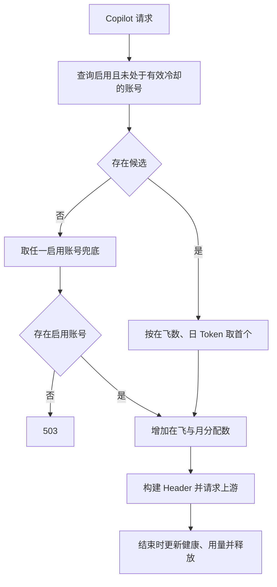

# 账号池与健康管理

[返回文档索引](./README.md)

## 模块概述

Copilot 请求从共享账号池选择较空闲账号，增加在飞请求数，结束后释放并记录健康及用量。ZJ 路径不使用此账号池。实现见 [db.py](../backend/db.py) 和 [server.py](../backend/server.py)，界面见 [AccountsPanel.vue](../frontend/src/components/AccountsPanel.vue)。

## 数据结构 / Schema

`accounts` 表由数据库启动初始化创建：

| 字段 | SQL Server 类型 | 含义 / 默认值 |
| --- | --- | --- |
| `account_id` | `NVARCHAR(64)` PK | 上游账号 ID |
| `display_name` | `NVARCHAR(128) NOT NULL` | 显示名 |
| `is_active` | `BIT NOT NULL DEFAULT 1` | 启用开关 |
| `active_count` | `INT NOT NULL DEFAULT 0` | 当前在飞请求数 |
| `total_requests` | `BIGINT NOT NULL DEFAULT 0` | 当前保存的月度分配次数 |
| `requests_reset_date` | `DATETIME2 NULL` | 最近一次分配时间，用于跨月重置 |
| `consecutive_failures` | `INT NOT NULL DEFAULT 0` | 连续失败数 |
| `status` | `NVARCHAR(16) NOT NULL DEFAULT 'healthy'` | healthy / degraded / down，无 CHECK 约束 |
| `cooldown_until` | `DATETIME2 NULL` | down 的冷却截止时间 |
| `daily_tokens`、`monthly_tokens`、`yearly_tokens` | 各为 `BIGINT NOT NULL DEFAULT 0` | 最近一次更新后的日/月/年 Token 累计 |
| `tokens_reset_date` | `DATETIME2 NULL` | 最近一次正 Token 累计时间 |

时间按 UTC。分配次数在下一次分配时懒重置；Token 计数在正用量写入时懒重置，读取不会清零。完整计量规则见 [Token 统计](./token_usage.md)。

## API / 函数规格

| 方法 / 路由 | 参数 | 响应 |
| --- | --- | --- |
| `GET /admin/accounts` | 无 | 账号数组，含禁用账号 |
| `POST /admin/accounts/{account_id}/reset-health` | 路径账号 ID，无 body | `{"status":"reset"}` |
| `POST /admin/accounts/reset-counts` | 无 body | `{"status":"reset"}`；重置所有账号在飞数 |

账号列表响应示例：

```json
[
  {
    "account_id":"demo_account",
    "display_name":"演示账号",
    "is_active":true,
    "active_count":1,
    "total_requests":20,
    "daily_tokens":100,
    "monthly_tokens":1000,
    "yearly_tokens":10000,
    "status":"healthy",
    "consecutive_failures":0,
    "cooldown_until":null
  }
]
```

| 数据库 / 编排函数 | 契约 |
| --- | --- |
| `get_least_used_account(exclude_account_ids=None)` | 返回账号 ID 或 None；按 `active_count ASC, daily_tokens ASC` 排序 |
| `_allocate_with_retry(db)` | 选择并增加计数；没有候选时从全部启用账号兜底；无启用账号则 503 |
| `increment_active_count(account_id)` | 增加在飞数与月度分配次数 |
| `decrement_active_count(account_id)` | 递减在飞数，下限 0 |
| `record_failure(account_id)` | 失败数加一，1–2 次 degraded，3 次起 down 并冷却 5 分钟 |
| `record_success(account_id)` / `reset_account_health(account_id)` | healthy、失败数 0、清空冷却时间 |
| `add_account(account_id, display_name)` / `set_account_active(account_id, active)` | 数据库内部函数，没有对应新增或启停 HTTP 路由 |

## 业务流程图



`degraded` 仍可被正常选择；down 但冷却为空或已过期也可被选中。冷却过期不主动修改 status，后续成功才恢复 healthy。

## 权限与安全

管理路由都依赖 [管理员权限](./admin_access.md)。账号池由所有租户和共享数据库的网关实例共用，不是租户私有资源；没有 RLS。

`reset-counts` 只清零 `active_count`，不清零请求数或 Token；存在在途请求时使用会影响负载估算。账号种子由 [config.py](../backend/config.py) 的 `get_seed_accounts()` 从本地 `SEED_ACCOUNTS_JSON` 环境变量读取，生产部署应审核实际账号授权。

## 边界条件与错误码

| 状态 / 条件 | 实际行为 / 排查 |
| --- | --- |
| `503 No available accounts` | 没有启用账号，而不仅是全部账号 down |
| 全部启用账号都在冷却 | 兜底仍选第一个启用账号，冷却并非严格隔离 |
| 上游失败 | 记录失败后返回错误；没有同一次请求换账号重试 |
| Copilot Header 构建失败 | 减在飞数并返回 500，不增加健康失败数、不写请求日志 |
| 管理员 reset 不存在账号 | UPDATE 无命中也返回 200，不返回 404 |
| 管理 API 非管理员访问 | 403，详见 [访问控制](./admin_access.md) |

> [!WARNING]
> `_allocate_with_retry()` 虽有重试命名及三次循环，但选到账号立即返回，排除列表没有被追加；不能据此承诺失败重试。查询与计数递增也是分开的事务，多个进程可能同时选择同一账号。

在飞数泄漏检测依赖**全局** `request_log` 最近时间：超过 10 分钟没有完成记录时，会清零符合条件的在飞数，无法辨别真正的长时间请求。流式底层将部分错误转换为 SSE 数据，清理层未捕获异常时仍调用 `record_success()`；客户端取消也不应被视为可靠的上游健康信号。
