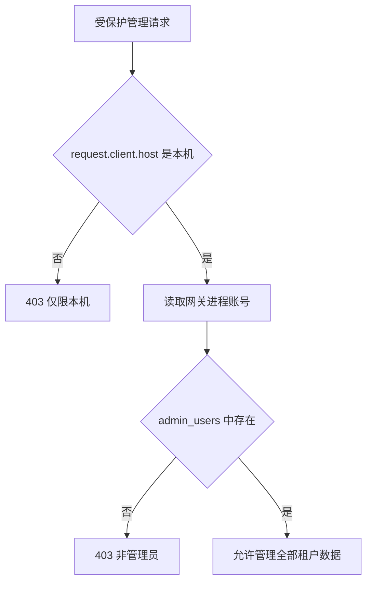

# 管理员访问控制

[返回文档索引](./README.md)

## 模块概述

管理 API 基于请求来源与网关进程的 Windows 账号授权。`require_admin()` 位于 [admin_api.py](../backend/admin_api.py)，账号读取位于 [config.py](../backend/config.py)，管理员名单位于 [db.py](../backend/db.py)。

没有登录页、密码、Cookie 会话、JWT、OAuth 或浏览器 Windows 集成认证。权限表只区分“管理员”和“非管理员”，不提供细粒度角色。

## 数据结构 / Schema

| `admin_users` 字段 | SQL Server 类型 | 含义 |
| --- | --- | --- |
| `domain_account` | `NVARCHAR(128)` PK | 对比网关进程读取到的账号字符串 |
| `display_name` | `NVARCHAR(128) NOT NULL` | 显示名 |

没有 is_active 或角色字段；删除即移除权限。数据库初始化不会自动添加管理员，表名是 `admin_users`，不是 `admins`。

## API / 函数规格

| 方法 / 路由 | 参数 | 响应 / 鉴权 |
| --- | --- | --- |
| `GET /admin/auth/check` | 无 | `is_admin`、`domain_account`；未依赖 require_admin |
| `GET /admin/admins` | 无 | 管理员数组；需管理员 |
| `POST /admin/admins` | `domain_account: string` 必填；`display_name: string` 默认同账号 | `{"status":"added"}`；需管理员 |
| `DELETE /admin/admins/{domain_account}` | 路径账号 | `{"status":"removed"}`；需管理员 |
| `require_admin(request)` | Request | 通过时返回账号 string，否则抛 HTTPException |
| `get_windows_domain_account()` | 无 | 优先环境变量 USERNAME，其次 getpass.getuser()，最后 unknown |

授权状态响应示例：

```json
{"is_admin":true,"domain_account":"demo_admin"}
```

添加管理员请求及列表响应：

```json
{"domain_account":"demo_admin","display_name":"开发管理员"}
```

```json
[{"domain_account":"demo_admin","display_name":"开发管理员"}]
```

重复添加同账号不更新显示名，仍返回 added；删除不存在账号仍返回 removed。

### 首次授权

启动后先读取 `/admin/auth/check` 中的 domain_account，使用具备数据库写权限的受信任运维连接，在**网关连接的数据库**执行以下示例，将账号替换为实际返回值：

```sql
IF NOT EXISTS (SELECT 1 FROM admin_users WHERE domain_account = N'demo_admin')
    INSERT INTO admin_users (domain_account, display_name)
    VALUES (N'demo_admin', N'开发管理员');
```

刷新页面即可。权限按请求重新查询，不需要为了名单变更重启。用独立运维连接保留恢复入口，避免仅剩的管理员误删自己后无法操作。

## 业务流程图



允许的来源字符串为 `127.0.0.1`、`::1`、`localhost`。HTTP 服务正常由 ServerRunner 绑定 IPv4 `127.0.0.1`。

## 权限与安全

> [!WARNING]
> `domain_account` 是运行网关进程的账号，不是发送 HTTP 请求的用户。若网关运行在管理员账号下，可访问该本机端口的其他进程也会以该管理员身份通过检查。此设计不能替代远程、多用户部署所需的独立认证。

`/admin/auth/check` 没有本机来源依赖，返回的是进程身份与名单匹配结果；其他业务管理路由才执行完整 require_admin。静态管理页面本身也没有该依赖，敏感数据和操作由 API 检查约束。

全局 CORS 配置允许全部 origins、methods、headers，并设置 allow_credentials；没有 CSRF token 或 Origin 白名单。若增加远程监听、反向代理或跨用户访问，必须重新设计身份和浏览器访问边界。项目未实施数据库 RLS。

## 边界条件与错误码

| HTTP 状态 / 条件 | 返回 / 排查 |
| --- | --- |
| `403`，非本机来源 | `{"detail":"Admin access only from localhost"}` |
| `403`，进程账号不在名单 | `{"detail":"User 'demo_admin' is not an admin"}` |
| `GET /admin/auth/check` 返回 false | 正常 200，前端展示无权限提示；按返回账号核对表 |
| POST 缺少 domain_account | 直接字典取值触发 KeyError，通常 500，不是结构化 422 |
| 删除自己或最后一位管理员 | 没有保护，当前请求成功，后续管理请求可能 403 |
| 账号大小写不同 | 是否匹配取决于 SQL Server 数据库排序规则，代码未统一大小写 |
| 远端浏览器经本机代理访问 | 后端可能只看到代理的本机来源；不能据此识别浏览器用户 |

管理员身份不带 `DOMAIN\\` 前缀的保证；以 `/admin/auth/check` 实际输出为准。不要直接把 `whoami` 的完整域用户名当成必然匹配值。
