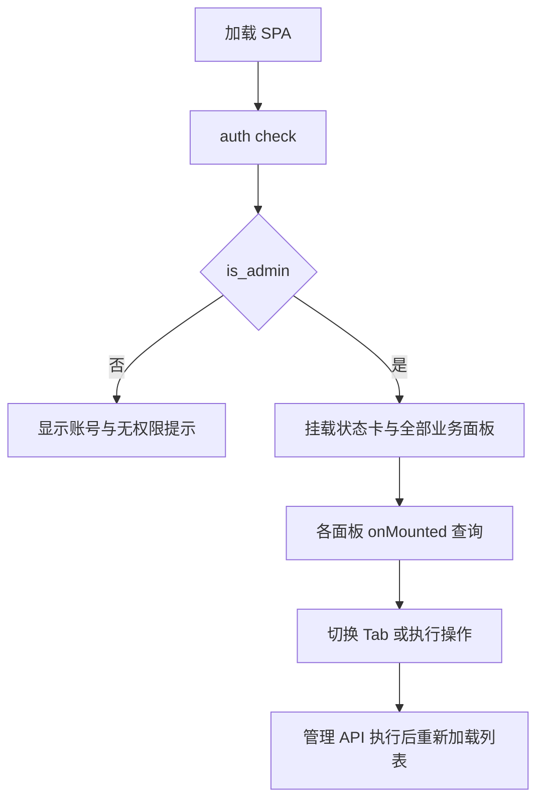

# Web 管理界面

[返回文档索引](./README.md)

## 模块概述

Vue 3 管理 SPA 提供账号、API Key、租户、管理员、Token 用量五个 Tab，顶部另有状态统计卡片。主入口为 [App.vue](../frontend/src/App.vue)，不是六个独立路由页面；未使用 Vue Router、Pinia 或 UI 组件库。

后端在 `/admin` 挂载静态资源，API Router 先于静态挂载注册。各业务组件通过 [api.js](../frontend/src/api.js) 调用管理 API。

## 数据结构 / Schema

前端不直连数据库、不新增表；各表结构分别见 [账号池](./account_pool.md)、[API Key](./api_key_management.md)、[租户](./tenant_management.md)、[管理员](./admin_access.md) 和 [用量](./token_usage.md)。

| 状态 / 组件 | 类型 / 数据 | 用途 |
| --- | --- | --- |
| App `domainAccount`、`isAdmin`、`authChecked` | string、boolean、boolean | 显示账号与权限分支 |
| App `activeTab` | string，默认 accounts | CSS 类切换面板显示，不更新 URL |
| App `status` | object / null | 顶部统计卡片数据 |
| AccountsPanel `accounts` | object[] | 账号列表、刷新与在飞数重置 |
| KeysPanel `keys`、`tenants`、`newKey` | object[]、object[]、string | 创建、吊销、轮换及新 Key 弹窗 |
| TenantsPanel | 表单 refs 与租户数组 | 新建、编辑、删除 |
| AdminsPanel | 表单 refs 与管理员数组 | 添加和移除 |
| TokenUsagePanel | rows、selectedModel、searchText、sortKey、sortAsc | 模型请求筛选、本地账号搜索和数值排序 |

## API / 函数规格

| 页面 / 组件 | 依赖 API | 主要行为 |
| --- | --- | --- |
| App | `GET /admin/auth/check`、`GET /admin/status` | 挂载时鉴权，通过后查询状态 |
| StatsGrid | 接收 status prop | 展示活跃账号、Key、租户和异常账号数 |
| AccountsPanel | `GET /admin/accounts`、`POST /admin/accounts/reset-counts` | 无新增、启停或单账号健康重置按钮 |
| KeysPanel | `/admin/keys` 及轮换/吊销接口，`GET /admin/tenants` | Key 路径使用 encodeURIComponent |
| TenantsPanel | `/admin/tenants` 的 GET/POST/PUT/DELETE | 模型输入按英文逗号拆分 |
| AdminsPanel | `/admin/admins` 的 GET/POST/DELETE | 删除前浏览器 confirm |
| TokenUsagePanel | `GET /health`、`GET /admin/token-usage?model=...` | 模型选项来自 health.supported_models |

管理列表的完整响应示例见各功能文档。界面首个鉴权响应示例：

```json
{"is_admin":true,"domain_account":"demo_admin"}
```

`api(path, opts={}) -> Promise<any>` 使用同源 `fetch`：非 2xx 尝试读取 JSON `detail`，否则用 HTTP 状态文字抛 Error；成功返回 `res.json()`。不会自动加认证头、Content-Type、重试或统一错误弹窗。

```javascript
import { api } from './api.js'

const tenants = await api('/admin/tenants')
await api('/admin/tenants/alpha-team', {
  method: 'PUT',
  headers: { 'Content-Type': 'application/json' },
  body: JSON.stringify({ allowed_models: [] })
})
```

`fmtTokens(n)` 在大于等于 1000/1000000 时转为一位小数的 K/M 展示；底层数值不改变。`Modal` 接收 visible/title，发出 close，提供默认、actions、extra 三个 slot。

## 业务流程图



进入管理员分支后所有 Tab 的组件都会挂载，隐藏只是 CSS，不是延迟加载。切换 Tab 不自动重新查询；页面没有定时轮询。

## 权限与安全

前端隐藏内容仅改善交互，最终权限由 [管理 API](./admin_access.md) 校验。浏览器没有独立登录态或 Key 持久化逻辑；Key 列表的完整值会进入页面内存，即使表格仅显示 key_display。

开发模式由 [vite.config.js](../frontend/vite.config.js) 在端口 3000 运行，代理 `/admin`、`/v1`、`/messages`、`/health` 到 `127.0.0.1:9899`。后端端口变更不会自动同步代理目标；开发服务应保留本机访问边界。

构建使用 `base: './'`，产物放在 `frontend/dist`。源码模式优先托管该目录，否则回退 frontend 源目录；冻结模式读取打包资源中的 frontend。命令见 [运行与打包](./runtime.md)。

## 边界条件与错误码

| 现象 | 原因 / 排查 |
| --- | --- |
| `/admin/` 空白或 .vue 模块加载失败 | 未生成 dist 却用后端直接托管源码；运行 Vite 开发服务或构建前端 |
| 一直“正在验证权限” | checkAuth 没有 catch/finally；网络失败时 authChecked 不更新，查看控制台和 Network |
| 首次渲染报 status null 属性错误 | App 初值为 null，显式 null 不触发 StatsGrid prop 默认值；当前存在此渲染风险 |
| 操作返回 403 | 进程账号或本机访问检查失败，不能仅凭前端 isAdmin 判断 |
| 操作失败但没有明确提示 | 多数组件没有捕获 api() 抛出的异常 |
| 清空模型框后限制仍在 | 前端发 null，后端解释为不更新；要解除需 PUT 空数组 |
| 新增数据后顶部统计不变 | 操作只刷新各自列表；没有全局状态刷新联动 |
| Token 模型列总是“全部” | 未筛选时服务端跨模型聚合，并未返回分模型明细 |

错误结构 `{"error":...}` 无 detail 时，api() 只显示状态文字。当前也没有分页、大整数精度保护或表单字段长度验证；大规模使用时需评估这些约束。
