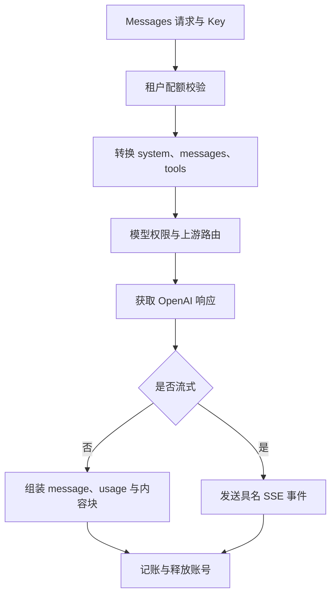

# Anthropic 消息兼容

[返回文档索引](./README.md)

## 模块概述

`POST /v1/messages` 与 `POST /messages` 共用处理逻辑，将 Anthropic Messages 请求转为上游 OpenAI 消息，再把结果转换回 Anthropic 格式。支持文本、推理内容和工具调用，面向使用 Messages 协议的客户端。

入口位于 [server.py](../backend/server.py)，转换实现在 [proxy_core.py](../backend/proxy_core.py)。这是部分协议兼容实现，不覆盖 Anthropic 全部参数、多模态输入或工具执行能力。

## 数据结构 / Schema

不新增数据库表。鉴权、配额及记账关联 [租户](./tenant_management.md)、[API Key](./api_key_management.md) 和 [Token 统计](./token_usage.md) 中的表。

| 字段 | 类型 | 转换规则 |
| --- | --- | --- |
| `model` | string | 缺失或空值回填 `Qwen3.6-27B-VL` |
| `system` | string / array | 提取为首条 `role: system` 消息 |
| `messages` | array | 缺失按空数组处理；转换 `role` 与内容块 |
| `messages[].content` | string / array | 文本拼接；工具块转换见 [工具调用](./tool_calling.md) |
| `stream` | boolean | 默认 `false`，通过 Python `bool()` 转换 |
| `max_tokens` | integer | 缺失默认 `4096`，显式 `null` 不会回填 |
| `temperature`、`top_p` | number | 非空时透传 |
| `stop_sequences` | array of string | 改名为 OpenAI `stop` |
| `tools`、`tool_choice` | array / object | 转换为 OpenAI function calling |
| 其他顶层字段 | 任意 | 当前未转发，例如 `metadata`、`thinking`、`top_k` |

响应内容块可能为 `text`、`thinking`、`tool_use`。非流式 `usage.input_tokens` 来自 `prompt_tokens`，`usage.output_tokens` 来自 `completion_tokens`；不存在时为 0。

## API / 函数规格

| 路由 / 函数 | 输入 | 输出 |
| --- | --- | --- |
| `POST /v1/messages`、`POST /messages` | API Key 与 Messages JSON | JSON message 或具名 SSE 事件 |
| `build_upstream_body_from_anthropic(body)` | Messages 字典 | OpenAI 请求字典 |
| `convert_anthropic_messages_to_openai_full(body)` | 含 system/messages 的字典 | OpenAI 消息数组 |
| `non_stream_anthropic_response(upstream_body, headers, model, url=None)` | 上游请求参数 | Anthropic message 字典 |
| `stream_anthropic_response(upstream_body, headers, model, url=None)` | 上游请求参数 | Anthropic SSE 异步生成器 |

请求示例：

```http
POST /v1/messages HTTP/1.1
Host: 127.0.0.1:9899
x-api-key: <gateway-api-key>
Content-Type: application/json

{
  "model": "GLM-V5",
  "system": "请用中文回答。",
  "messages": [{"role": "user", "content": [{"type": "text", "text": "你好"}]}],
  "max_tokens": 256,
  "stream": false
}
```

非流式响应示例：

```json
{
  "id": "msg_0123456789abcdef01234567",
  "type": "message",
  "role": "assistant",
  "content": [{"type": "text", "text": "你好！"}],
  "model": "GLM-V5",
  "stop_reason": "end_turn",
  "stop_sequence": null,
  "usage": {"input_tokens": 12, "output_tokens": 3}
}
```

网关生成 `msg_` ID，不保留上游响应 ID。读取第一项 `choices`；非流式 JSON 解析失败时把 HTTP 响应文本包装为 text 块。无内容时返回空 text 块。

### 推理与停止原因

非流式优先读取 `message.reasoning_content`，其次 `message.reasoning`；流式优先读取 `delta.reasoning`，其次 `delta.reasoning_content`，转换为 `thinking` / `thinking_delta`。没有 thinking 签名或预算控制。

| OpenAI `finish_reason` | Anthropic `stop_reason` |
| --- | --- |
| `stop` | `end_turn` |
| `length`、`max_tokens` | `max_tokens` |
| `tool_calls`、`function_call` | `tool_use` |
| `content_filter` | `stop_sequence` |
| 未知非空值 | `end_turn` |

存在工具调用时最终停止原因强制为 `tool_use`，`stop_sequence` 始终为 `null`。

### 流式事件

依次输出 `message_start`、`ping`、内容块 start/delta、各块 stop、`message_delta`、`message_stop`。text 使用 `text_delta`，thinking 使用 `thinking_delta`，工具参数使用 `input_json_delta`。

```text
event: content_block_delta
data: {"type":"content_block_delta","index":0,"delta":{"type":"text_delta","text":"你好"}}

event: message_delta
data: {"type":"message_delta","delta":{"stop_reason":"end_turn","stop_sequence":null},"usage":{"output_tokens":0}}

event: message_stop
data: {"type":"message_stop"}

```

以上为事件片段，前面需有 message/content block 的 start 事件。网关在请求上游前就发出 message_start 与 ping；多个内容块可能同时处于打开状态，到结尾统一关闭。

## 业务流程图



## 权限与安全

沿用 [API Key](./api_key_management.md) 和 [租户权限](./tenant_management.md)。`anthropic-version` Header 不参与版本校验，网关不会依据其改变转换行为。上游配置及 TLS 行为参见 [模型路由](./model_routing.md)。

用户内容中的图片块会变为 `[Image omitted]` 文本，assistant 历史消息中的 thinking 等非 text/tool_use 块会被忽略。不能把此接口当作完整图片或推理历史转发通道。

## 边界条件与错误码

| 状态 / 情况 | 当前行为与排查 |
| --- | --- |
| `401`、`403`、`429` | 与 OpenAI 共用鉴权及配额逻辑 |
| `500`、`503` | 请求处理、Copilot Header 或账号分配失败，见 [OpenAI 代理](./openai_chat.md) |
| `502` | 非流式上游非 200 或连接/处理异常 |
| 流式上游失败 | 可能仍为 HTTP `200`，先发 text 错误块，再发 `event: error`，随后关闭消息 |
| `stream: "false"` | 非空字符串被 `bool()` 视为真；必须传 JSON boolean |
| 流式 Token 始终为 0 | 没有注入用量选项，也没有解析/传递统计；不是实际免费调用 |
| 多项 `choices` | 仅转换第一项，不能依赖多候选输出 |

流内错误 JSON 示例：

```json
{"type":"error","error":{"type":"api_error","message":"Upstream error (503): unavailable"}}
```

> [!NOTE]
> HTTP 层鉴权错误仍为 FastAPI `detail` 结构，不会自动转换成 Anthropic 标准 error 对象。流式遇到 `finish_reason` 即结束上游遍历；开发时应分别验证文本、thinking、工具参数及客户端取消场景。
