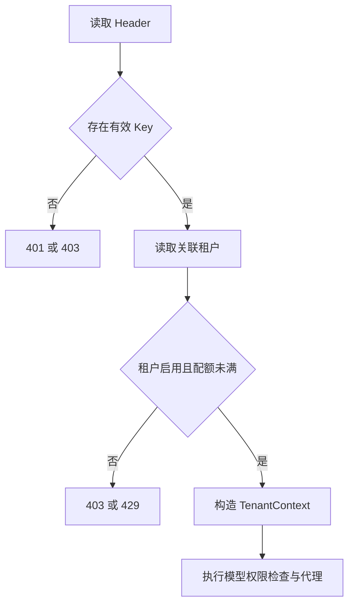

# API Key 鉴权与管理

[返回文档索引](./README.md)

## 模块概述

使用数据库保存的 API Key 识别租户，提供创建、吊销与轮换操作。客户端鉴权实现位于 [server.py](../backend/server.py) 的 `verify_api_key()`，管理接口位于 [admin_api.py](../backend/admin_api.py)，持久化位于 [db.py](../backend/db.py)。

API Key 控制模型 API 的访问；管理后台通过 [管理员访问控制](./admin_access.md) 授权，不接受 Key 替代管理员身份。

## 数据结构 / Schema

| `api_keys` 字段 | SQL Server 类型 | 含义 |
| --- | --- | --- |
| `key_value` | `NVARCHAR(128)` PK | 完整明文密钥，同时作为管理 API 路径标识 |
| `tenant_id` | `NVARCHAR(64) NOT NULL` | 逻辑关联 tenants，没有数据库外键 |
| `name` | `NVARCHAR(128) NOT NULL DEFAULT ''` | 备注名 |
| `is_active` | `BIT NOT NULL DEFAULT 1` | 1 可用于验证，0 已吊销 |

没有 `key_id`、过期时间、哈希、创建时间或最近使用时间字段。`key_display` 为响应计算字段，取前 12 个字符后加 `...`，不落库。

## API / 函数规格

### 客户端鉴权

适用 `/v1/chat/completions`、`/v1/messages`、`/messages`、`/v1/models` 及 `/v1/models/{model_id}`。Header 选择顺序：

1. Authorization 以不区分大小写的 `Bearer ` 开头时，取其后内容并 strip；即使结果为空也不回退。
2. 否则优先 `x-api-key`，再使用原始 Authorization 全值。
3. 空 Key 返回 401；数据库未命中有效 Key 返回 403。

建议使用以下两种形式之一：

```http
Authorization: Bearer <gateway-api-key>
```

```http
x-api-key: <gateway-api-key>
```

### 管理 API

| 方法 / 路由 | 参数 | 200 响应 |
| --- | --- | --- |
| `GET /admin/keys` | 无；HTTP 层没有租户筛选参数 | Key 对象数组，包含已吊销项 |
| `POST /admin/keys` | body `tenant_id: string` 默认 `default`；`name: string` 默认空 | `key_value` 与 `tenant_id` |
| `DELETE /admin/keys/{key_value:path}` | 完整 Key 路径，无 body | `{"status":"revoked"}` |
| `POST /admin/keys/{key_value:path}/rotate` | 完整旧 Key 路径，无 body | `{"key_value":"新密钥"}` |

调用路径应对密钥执行 URL 编码；`:path` 是 FastAPI 路径转换器语法，实际 URL 不包含它。

创建请求及响应示例，前提是租户已经创建：

```json
{"tenant_id":"alpha-team","name":"dev-client"}
```

```json
{"key_value":"sk-gateway-000000000000000000000001","tenant_id":"alpha-team"}
```

列表响应示例：

```json
[{"key_value":"sk-gateway-000000000000000000000001","key_display":"sk-gateway-0...","tenant_id":"alpha-team","name":"dev-client","is_active":true}]
```

以上密钥仅为示例。生成实现为 `sk-gateway-` 加 `uuid.uuid4().hex[:24]`。数据库函数 `validate_api_key(key_value)` 返回 `ApiKeyRow` 或 None；`create_api_key(tenant_id, name='')` 返回完整 Key；`revoke_api_key(key_value)` 返回 None；`rotate_api_key(key_value)` 返回新 Key。

## 业务流程图



轮换读取旧 Key 的租户和名称，先提交旧 Key 的吊销，再调用创建方法插入新 Key。旧 Key 的 `is_active` 不影响能否发起轮换。

## 权限与安全

所有 `/admin/keys` 操作要求本机管理员。Key 验证是每次请求查询数据库，没有额外 Key 缓存；吊销影响后续鉴权，不主动取消已通过鉴权的在途请求。

> [!WARNING]
> 密钥明文存储，列表接口也返回完整值；界面的“仅显示一次”只是交互提示，并非服务端保证。吊销/轮换 URL 包含完整 Key，而请求日志记录完整路径，因此日志可能包含密钥。限制数据库、日志和管理界面的读取权限。

`DEFAULT_API_KEY` 用于启动种子数据。未设置或为空时不创建种子密钥，不再提供固定回退密钥。应配置独立非空值，具体启动行为见 [数据库初始化](./database.md)。没有数据库 RLS 或自动过期机制。

## 边界条件与错误码

| HTTP 状态 / 情况 | 响应 / 行为 | 排查建议 |
| --- | --- | --- |
| `401` | `{"detail":"Missing API key"}` | 检查 Header，特别是空 Bearer 覆盖 x-api-key |
| `403` | `Invalid API key` | 检查值与 is_active |
| `403` | `Tenant inactive or not found` | 检查租户逻辑关联 |
| `429` | `Quota exceeded` | 查看 [自然小时配额](./tenant_management.md) |
| 轮换不存在 Key | `ValueError` 未转换为 404，通常为 500 internal_error | 先读取 Key 列表再操作 |
| 吊销不存在 Key | 返回 200 revoked，未验证更新行数 | 如需确定结果，重新读取 |
| 为不存在租户创建 Key | 仍可插入；推理请求随后返回 403 | 创建 Key 前核对 tenant_id |
| 轮换第二步插入失败 | 旧 Key 已吊销，整体不是原子事务 | 重新为对应租户创建 Key，并更新客户端 |

名称超长、非法 JSON 或不合适字段类型没有统一校验，可能产生 500。不要依赖当前 API 自动返回 422 参数错误。
