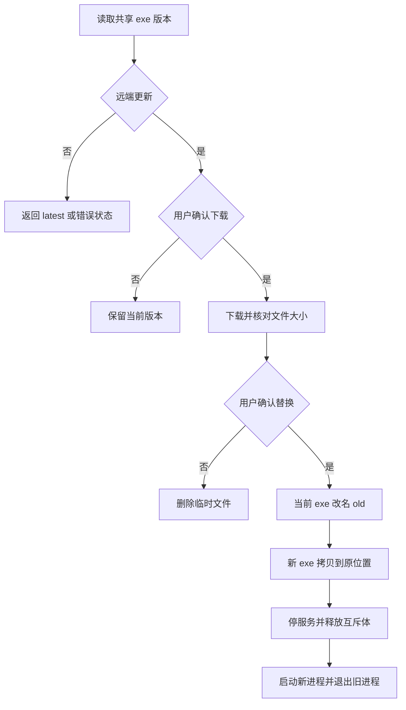

# 自动更新

[返回文档索引](./README.md)

## 模块概述

从指定网络共享目录读取 `LLM-API-Gateway.exe` 的 Windows FileVersion，与本机应用版本比较。发现新版本后由用户确认下载，再次确认替换，最终停止服务并启动新进程。

实现在 [updater.py](../backend/updater.py)，入口触发点在 [main.py](../backend/main.py) 与 [tray.py](../backend/tray.py)。没有更新 HTTP API，也没有云发布服务。

## 数据结构 / Schema

不新增数据库表；更新过程中仅调用当前线程的 `db.close()`，数据库 Schema 随新版本下次启动初始化。

| 结构 / 文件 | 类型 | 含义 |
| --- | --- | --- |
| `UpdateInfo.local_version` | str | backend.__version__，当前为 2.7.0 |
| `UpdateInfo.remote_version` | str | 共享 exe 的 FileVersion 文本 |
| `UpdateInfo.share_exe_path` | pathlib.Path | 待下载源文件 |
| `LLM-API-Gateway.exe.new` | 本地文件 | 与当前 exe 同目录的下载临时文件 |
| `LLM-API-Gateway.exe.old` | 本地文件 | 原 exe 重命名后的备份 |
| `.update_success` | 应用数据目录中的 UTF-8 文本 | 启动标记，内容为 UTC ISO 时间，不含版本或 exe 路径 |
| `_single_instance_mutex` | Win32 句柄 / None | 重启前释放单实例保护 |

文件名由 `sys.executable` 及后缀替换派生；共享目录目标名固定为 `LLM-API-Gateway.exe`。

## API / 函数规格

| 函数 | 参数 / 返回 | 行为 |
| --- | --- | --- |
| `parse_version(v)` | str → tuple[int, int, int] | 拆分数值版本；缺少 patch 时为 0，只比较前三段 |
| `check_for_update()` | 无 → `(status, info)` | 读取共享文件版本并比较 |
| `check_and_prompt_startup(runner, db)` | 返回 bool | 启动后同步检查；取消更新返回 false |
| `check_and_prompt_manual(icon, runner, db)` | 返回 None | 托盘后台线程执行交互更新 |
| `schedule_periodic_check(icon)` | 无返回值 | 按小时配置通知有新版本，不自动下载或替换 |
| `_copy_with_progress(src, dst, progress_callback=None)` | Path、可选回调 | 每块 1 MiB 复制，回调百分比；交互调用未传回调 |
| `_perform_replace_and_restart(runner, db)` | 运行器与数据库 | 替换 exe、停服务、释放互斥体、Popen 新版并 os._exit(0) |
| `cleanup_old_version()` | 无 | frozen 模式清理旧包；根据已有 marker 判断 |
| `write_update_success_marker()` | 无 | 写 UTC 时间标记；失败只记录 warning |

检查函数的状态表：

| status | info 类型 | 含义 |
| --- | --- | --- |
| `available` | UpdateInfo | 远端版本大于本地 |
| `latest` | None | 远端小于等于本地，不执行降级 |
| `no_path` | None | 未配置共享目录 |
| `error` | str | 文件不存在或无法读取版本等显式错误 |

内部返回是 tuple/dataclass，不是 HTTP JSON。以下仅示意序列化后的 available 结果：

```json
{
  "status":"available",
  "info":{
    "local_version":"2.7.0",
    "remote_version":"2.8.0",
    "share_exe_path":"\\\\fileserver\\gateway-release\\LLM-API-Gateway.exe"
  }
}
```

### 触发与替换步骤

启动检查在服务启动之后执行；`--skip-update` 跳过该检查及启动旧包清理。托盘“检查更新”走后台线程；周期检查首次等待 `UPDATE_CHECK_INTERVAL_HOURS` 小时，之后同间隔检查，默认 24 小时。周期检查只发托盘通知，没有自动下载或自动确认。

交互流程为：确认更新 → 下载到 `.exe.new` → 对比源与目标文件大小 → 再次确认 → 当前 exe 改名 `.exe.old` → 拷贝新 exe 到原位置 → 删除 `.exe.new` → 停止服务/关闭当前线程数据库连接 → 释放互斥体 → 清除部分 PyInstaller 内部环境变量 → 启动新进程 → 强制退出旧进程。

新进程启动不保留原 CLI 参数，因此 `--port`、`--log-level`、`--skip-update` 等临时选项不会自动重放。常驻配置应通过受控 `.env` 管理。

## 业务流程图



## 权限与安全

| 配置 / 权限 | 要求 |
| --- | --- |
| `UPDATE_SHARE_PATH` | 留空禁用检查；运行账号需读取共享目录权限 |
| `UPDATE_CHECK_INTERVAL_HOURS` | 默认 24，应配置正整数；代码没有范围校验 |
| 本地 exe 目录 | 运行账号需创建、重命名、覆盖及删除文件权限 |
| 共享发布目录 | 发布权限应仅授予受信任发布者 |

> [!WARNING]
> 当前只比较文件大小，没有哈希或签名校验，FileVersion 也不是可信性证明。更新路径能提供可执行代码，必须控制共享目录写权限。交互更新流程没有 frozen 前置检查，源码运行时 sys.executable 指向 Python 解释器；源码开发应保持 UPDATE_SHARE_PATH 为空。

替换会停止本地服务，`runner.stop()` 最多等待线程 3 秒，然后更新器强制退出；没有确认所有在途流式请求已经完成的机制。更新也没有并发互斥，避免同时发起多次手动/启动交互流程。

## 边界条件与错误码

此模块不使用 HTTP 错误码，错误通过状态、异常、日志或 Windows 弹窗呈现。

| 情况 | 当前行为 / 排查 |
| --- | --- |
| 文件缺失 / FileVersion 读取失败 | check_for_update 返回 error；核对共享路径、权限和打包资源 |
| 版本包含 v 前缀或预发布后缀 | parse_version 可能 ValueError，不支持完整 SemVer 字符串 |
| 下载失败或大小不一致 | 清理临时文件并提示失败，保留当前 exe |
| 第二次确认取消 | 删除临时文件，继续当前进程 |
| 当前 exe 改名失败 | 抛 RuntimeError；检查锁定、目录权限和已存在的 .old |
| 新 exe 拷贝到原位失败 | 尝试把 .old 改回原名，但恢复异常被忽略，恢复并无保证 |
| Popen 失败或新版无法启动 | 没有完整异常恢复与健康探测自动回滚 |
| 周期检查失败 | 异常被忽略，下一个周期继续；不一定展示错误通知 |

### 旧包清理与恢复边界

frozen 模式启动时，若存在 `.old` 且已有 `.update_success`，会先删 marker，再尝试删除 `.old`；没有 marker 时保留 `.old` 并继续启动。主入口在发现 runner.server 对象后写 marker，并未执行真实端口或上游健康检查。

> [!WARNING]
> 替换前没有清除上一次运行的成功标记，新版本首次启动可能直接清掉 `.old`。因此“保留到新版本验证成功”并非可靠保证。发布时应另存已验证的旧版本包和数据库备份，不能只依赖自动生成的 .old。

当前没有自动健康回滚。人工恢复时先停止残留网关进程，使用独立保留的旧版包恢复可执行文件，核对 `.env` 和日志，再启动验证。仅恢复 exe 不会撤销新版本已执行的数据库 DDL；数据库兼容性需按 [初始化与迁移](./database.md) 单独处理。
