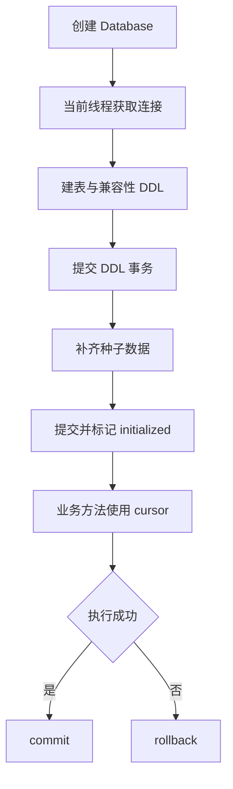

# 数据库初始化与持久化

[返回文档索引](./README.md)

## 模块概述

[db.py](../backend/db.py) 使用 pyodbc 访问 SQL Server，管理线程本地连接、自动建表、兼容性 DDL、种子数据和各功能查询。没有 ORM、迁移版本表或独立迁移命令。

`Database.initialize()` 会执行写操作及 Schema 变更；开发者应连接独立开发数据库，而非把初始化当作只读连接检查。

## 数据结构 / Schema

完整字段定义按所属功能维护，避免多份 Schema 描述漂移：

| 表 | 主键类型 | 主要字段 | 字段文档 |
| --- | --- | --- | --- |
| `accounts` | `account_id NVARCHAR(64)` | active_count、status、Token 缓存 | [账号池](./account_pool.md) |
| `tenants` | `tenant_id NVARCHAR(64)` | quota_limit、allowed_models JSON、Token 缓存 | [租户](./tenant_management.md) |
| `api_keys` | `key_value NVARCHAR(128)` | tenant_id、name、is_active | [API Key](./api_key_management.md) |
| `request_log` | `id BIGINT IDENTITY` | tenant_id、model、created_at | [配额请求记录](./tenant_management.md) |
| `token_usage` | `id BIGINT IDENTITY` | user_account、tenant_id、model、token_count、created_at | [Token 统计](./token_usage.md) |
| `admin_users` | `domain_account NVARCHAR(128)` | display_name | [管理员](./admin_access.md) |

所有表使用未显式指定 schema 的表名，落入连接用户的默认 schema。`tenant_id` 关联只是逻辑关系，没有 FOREIGN KEY；没有 RLS、JSON CHECK 或健康状态 CHECK。数据库未设置这些约束不代表应用保证了对应数据完整性。

| 显式非聚集索引 | 列顺序 | 用途 |
| --- | --- | --- |
| `ix_request_log_tenant_created` | tenant_id、created_at | 小时配额查询 |
| `ix_token_usage_account_tenant_model` | user_account、tenant_id、model、created_at | Token 汇总筛选 |

## API / 函数规格

本模块无独立 HTTP 路由，通过 [管理 API](./README.md) 和代理处理器间接调用。

| 函数 | 参数 / 返回 | 行为 |
| --- | --- | --- |
| `Database(connection_string=None)` | 可选 ODBC 连接串 | 默认从配置组装 |
| `_get_connection()` | 返回 pyodbc.Connection | 当前线程复用，先 SELECT 1，失败后重连 |
| `_cursor()` | 上下文管理器 | 正常退出 commit，异常 rollback，最后关闭 cursor |
| `initialize()` | 返回 None | `_create_tables()` 后 `_seed_data()`；当前对象成功后不重复执行 |
| `close()` | 返回 None | 只关闭调用线程的连接 |
| `get_db_connection_string()` | 返回 str | 驱动自动选择或使用 DB_DRIVER，含 TrustServerCertificate=yes |

仅在已准备独立测试数据库时使用的调用示例；此代码会初始化数据库：

```python
from backend.config import load_env
from backend.db import Database

load_env()
db = Database()
try:
    db.initialize()
    print(db.get_tenant("default"))
finally:
    db.close()
```

返回对象为 dataclass，不是 HTTP JSON；default 租户经管理接口序列化的示例结构如下：

```json
{"tenant_id":"default","name":"Default","quota_limit":-1,"allowed_models":[],"is_active":true,"daily_tokens":0,"monthly_tokens":0,"yearly_tokens":0}
```

### 初始化及兼容性变更

1. 使用 IF NOT EXISTS 创建六张表。
2. 给已有 tenants 补 Token 计数字段；给 request_log 补 model。
3. 删除 tenants.provider 及其默认约束。
4. 删除 token_usage 的旧 account_provider 索引、provider 默认约束及 provider 列；缺少 tenant_id 时补列并默认历史记录为 default。
5. 创建当前用量及配额索引，再插入种子数据。

> [!WARNING]
> 初始化包含 DROP COLUMN，不只是建表。旧 provider 信息会删除，没有转换到真实租户的映射过程。现有其他旧表结构也不一定完整迁移：例如没有通用 accounts 升级或 token_usage.model 补列逻辑。升级前应核对实际 Schema 并备份。

### 种子数据

每个新的进程/Database 对象初始化时都尝试补齐 本地 `SEED_ACCOUNTS_JSON` 配置的种子账号（默认空列表）、tenant_id 为 default 的租户，以及非空 DEFAULT_API_KEY 对应的密钥。存在同主键行时不覆盖。

不是“整个数据库只在首次启动写一次”：删除种子行后会被补回；被吊销但行仍存在的默认 Key 不会自动重新启用；改变 DEFAULT_API_KEY 会新增一条，旧 Key 不自动撤销。管理员不在种子数据范围。

## 业务流程图



## 权限与安全

环境变量为 DB_DRIVER、DB_SERVER、DB_DATABASE、DB_UID、DB_PWD，详见 [运行配置](./runtime.md)。源码未创建数据库本身；目标数据库必须存在，初始化连接需要执行实际建表、ALTER、索引和 DML 的权限。后续若要降为只读或仅 DML 账号，需先拆分启动迁移职责，当前实现未提供开关。

连接串使用 SQL 用户名/密码，不是 Windows 集成认证；强制 TrustServerCertificate=yes，没有显式指定 Encrypt，后者行为取决于 ODBC 驱动。业务值通常使用 `?` 参数，DDL 的列名为内部常量，租户更新并不提供任意 SQL 执行入口。

同一数据库供多个网关共享，但“线程本地连接”不等于“所有业务操作原子”：账号选择与递增、鉴权与配额记录、Key 轮换、记账多步骤分别提交。

## 边界条件与错误码

| 情况 | 当前结果 / 排查 |
| --- | --- |
| ODBC 驱动缺失 | 启动尝试安装，失败返回进程码 1；见 [运行配置](./runtime.md) |
| 数据库不存在、登录失败或 DDL 权限不足 | 初始化异常，主入口弹窗并返回 1 |
| 业务 SQL 失败 | 当前方法 rollback；由调用点决定 HTTP 500 或 502 |
| `_create_tables()` 成功而种子失败 | DDL 已提交，不会随种子回滚 |
| 多进程同时首次初始化 | IF NOT EXISTS 不提供完整并发初始化锁，可能遇到竞争 |
| 多 schema 存在同名表 / 索引 | 存在性检查部分仅按 TABLE_NAME 或索引名匹配，可能误判 |
| 在主线程调用 close | 不会统一关闭服务线程和定时器线程创建的连接 |

数据库调用为同步 pyodbc；多个 async HTTP 处理器直接调用它，没有统一线程池卸载层。SQL 缓慢时可能阻塞服务事件循环，性能排查应同时检查数据库与 HTTP 延迟。
