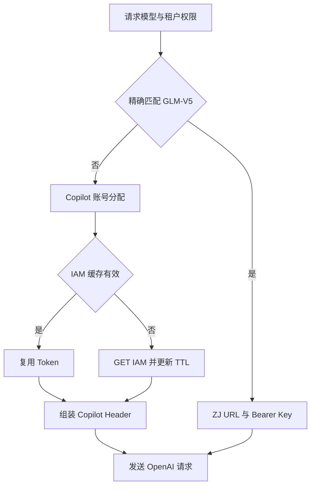

# 模型发现与上游路由

[返回文档索引](./README.md)

## 模块概述

提供可见模型目录，并根据请求的模型名选择 Copilot 或 ZJ。模型映射位于 [config.py](../backend/config.py)，路由在 [server.py](../backend/server.py)，IAM 缓存与 Header 组装在 [proxy_core.py](../backend/proxy_core.py)。

租户约束“允许使用哪些模型”，模型决定“访问哪个提供商”。没有基于租户选择上游、跨模型降级或多提供商自动容灾。

## 数据结构 / Schema

模型配置是进程内字典 `MODEL_PROVIDER_MAP: dict[str, str]`，不存数据库。`SUPPORTED_MODELS` 从该字典派生；租户限制来自 [tenants.allowed_models](./tenant_management.md)。

| 模型 ID | 提供商 | 认证 / 调度 |
| --- | --- | --- |
| `Qwen3.6-27B-VL` | `copilot` | IAM + 账号池；默认模型 |
| `MiniMax-M2.7` | `copilot` | IAM + 账号池 |
| `Glm-5.1` | `copilot` | IAM + 账号池 |
| `GLM-V5` | `zj` | 固定 Bearer API Key，无账号池 |

> [!NOTE]
> 匹配使用 Python 字典精确查找，区分大小写，不是子串或前缀匹配。未知模型也默认返回 `copilot`，不会在网关因“模型不存在”而自动拒绝。

| IAM 缓存字段 | 类型 | 含义 |
| --- | --- | --- |
| `TokenManager._token` | str / None | 当前进程共享的 IAM 原始响应文本 |
| `TokenManager._expire_time` | float | 本机时间戳；刷新开始时间加 TTL |
| `TokenManager._verify_ssl` | bool | TLS 证书校验选项；create_app 中设为 false |

## API / 函数规格

| 方法 / 路由 | 参数 | 返回 |
| --- | --- | --- |
| `GET /v1/models` | API Key Header | 支持列表与租户白名单的交集 |
| `GET /v1/models/{model_id}` | 路径 string；API Key | 指定模型的元数据；不验证是否在支持列表 |
| `get_provider_for_model(model)` | str | `copilot` 或 `zj` |
| `TokenManager.get_token()` | 无参数，异步 | 缓存有效则返回，否则请求 IAM |
| `build_upstream_headers(account_id=None)` | Copilot 账号 ID | 上游 Header 字典 |
| `build_zj_headers()` | 从环境读取 Key | ZJ Header 字典 |

某租户只允许两个模型时的目录响应示例：

```json
{
  "object": "list",
  "data": [
    {"id":"Qwen3.6-27B-VL","object":"model","owned_by":"copilot","created":1788480000},
    {"id":"GLM-V5","object":"model","owned_by":"zj","created":1788480000}
  ]
}
```

单个模型响应：

```json
{"id":"GLM-V5","object":"model","owned_by":"zj","created":1788480000}
```

`created` 是查询时生成的 Unix 秒时间戳，不是模型发布时间。查询模型接口也会检查小时配额，但不会新增 `request_log`。

### 上游请求契约

| 上游 | HTTP 调用 | 关键行为 |
| --- | --- | --- |
| IAM | `GET TOKEN_API_URL`，超时 10 秒 | `raise_for_status()`；读取并 strip 整个响应文本，不解析 JSON |
| Copilot | `POST COPILOT_API_URL` | 发送 OpenAI JSON；`Authorization` 直接写入 IAM 文本，不自动加 Bearer |
| ZJ | `POST ZJ_API_URL` | `Authorization: Bearer <ZJ_API_KEY>` |

Copilot 还发送 `User-Account`（分配的账号）、`X-HDP-Call-Source`（`APP_ID`）、`User-Agent: ClaudeProxy/1.0`，双方都发送 JSON Content-Type 与支持 SSE/JSON 的 Accept。

## 业务流程图



图示为默认 `dynamic_token` 模式；`none` 模式直接省略 Copilot Authorization。

## 权限与安全

| 环境变量 | 含义 |
| --- | --- |
| `COPILOT_API_URL`、`TOKEN_API_URL` | Copilot 与 IAM 地址，默认空值 |
| `APP_ID` | 调用来源 Header |
| `UPSTREAM_AUTH_TYPE` | 实际支持 `dynamic_token`、`none` |
| `TOKEN_CACHE_TTL` | Token 缓存秒数，默认 240 |
| `ZJ_API_URL`、`ZJ_API_KEY` | ZJ 地址与固定凭据 |
| `UPSTREAM_TIMEOUT` | 模型 HTTPX 超时配置，默认 300 秒 |

完整配置见 [运行配置](./runtime.md)。HTTPX 标量 timeout 作用于连接、读写、连接池等超时阶段，不应理解为所有流式会话的总时长上限。

> [!WARNING]
> create_app 显式用 `verify_ssl=False` 创建 TokenManager 和 ProxyCore，当前没有环境变量开关启用证书验证。部署到需要校验证书的环境前需修改实现。`basic`、`bearer`、`raw` 虽有常量声明，但 Header 组装未实现，实际记录 warning 并回退 dynamic_token。

IAM 缓存是单进程级，不按账号隔离，也没有并发刷新锁或上游 401 后立即失效机制。Header 安全化仅处理字符编码，不是完整的凭据或 CRLF 验证。

## 边界条件与错误码

| 状态 / 情况 | 结果与排查 |
| --- | --- |
| `401`、`403`、`429` | Key、租户或配额问题；模型目录也受限制 |
| 模型不在租户白名单 | `403`，检查精确拼写与大小写 |
| 未登记模型且无租户限制 | 单模型查询仍 `200`；推理请求转发 Copilot，由上游决定是否支持 |
| IAM 空响应 | `RuntimeError: IAM token API returned empty response`，Copilot 路由返回 `500` |
| IAM 返回 JSON 对象文本 | 全部文本被当成 Authorization，可能遭上游拒绝 |
| ZJ Key 为空 | 仍构造 `Bearer `，不会在网关提前报配置错误 |
| 上游认证失败 | 非流式通常 `502`，流式为流内错误；不会自动换提供商 |

新增模型时更新 `MODEL_PROVIDER_MAP` 并核对租户白名单、模型目录及两个协议的目标分支；模型目录不是上游实时可用性探测。
