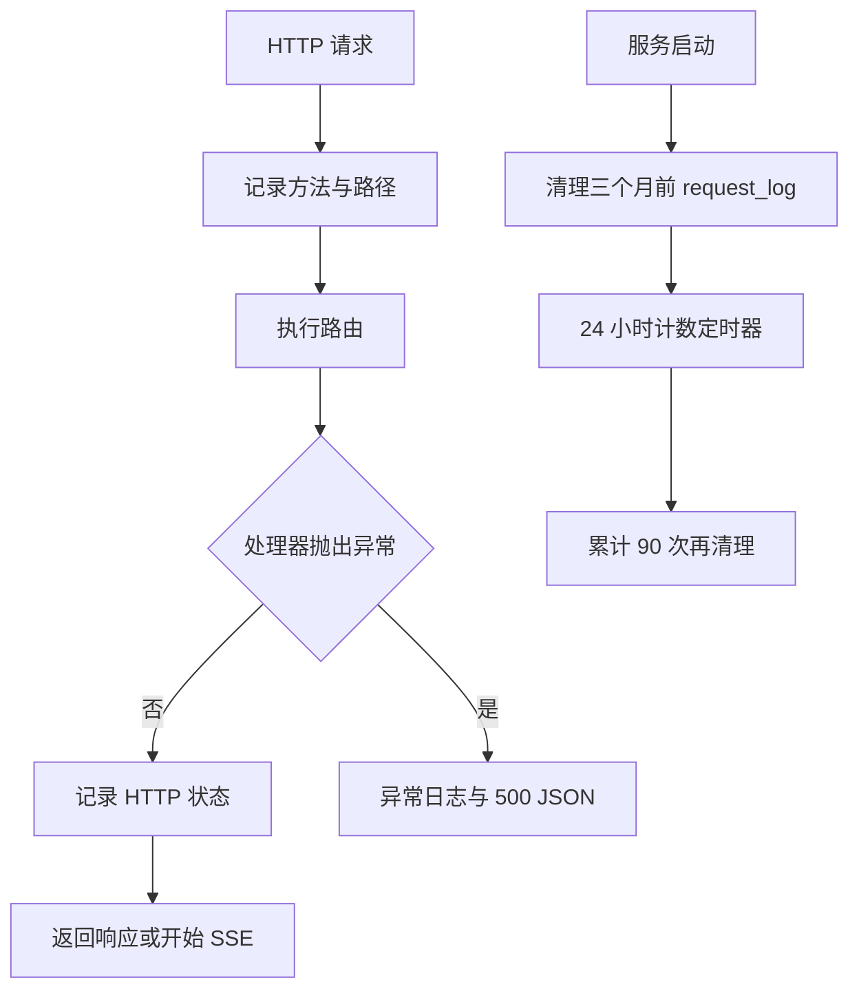

# 健康检查与可观测性

[返回文档索引](./README.md)

## 模块概述

提供根路径服务信息、无需鉴权的存活检查、管理员状态汇总和本地滚动日志。实现分布在 [server.py](../backend/server.py)、[config.py](../backend/config.py) 与 [db.py](../backend/db.py)。

当前没有 Prometheus 指标端点、分布式追踪、请求关联 ID、持久化延迟或独立的依赖就绪检查。

## 数据结构 / Schema

状态汇总读取 [accounts](./account_pool.md)、[api_keys](./api_key_management.md)、[tenants](./tenant_management.md)，不新增表；配额流水结构见 [request_log](./tenant_management.md)。

| 状态字段 | JSON 类型 | 实际口径 |
| --- | --- | --- |
| `active_accounts` | integer | is_active=1 的账号数量，包括 down |
| `active_keys` | integer | is_active=1 的 Key 数量，不校验其租户是否有效 |
| `active_tenants` | integer | is_active=1 的租户数 |
| `unhealthy_accounts` | integer | status 不为 healthy 的全部账号，含禁用账号 |
| `zj_model_count` | integer | 静态模型映射中 zj 条目数，当前为 1 |
| `accounts` | array | 所有账号状态，按 active_count 降序，不带 is_active |

## API / 函数规格

| 方法 / 路由 | 鉴权 | 返回 |
| --- | --- | --- |
| `GET /` | 无 | name、status、endpoints |
| `GET /health` | 无 | status、listen、upstream、supported_models、timestamp |
| `GET /admin/status` | [管理员](./admin_access.md) | 状态汇总对象 |
| `configure_logging(level=None)` | 进程内部调用 | 初始化日志并返回日志 Path |
| `cleanup_old_request_logs(months=3)` | 数据库内部调用 | 删除历史配额日志并返回行数 |

根路径响应：

```json
{"name":"LLM API Gateway","status":"ok","endpoints":["/v1/messages","/messages","/v1/chat/completions","/v1/models","/health"]}
```

健康响应示例：

```json
{
  "status":"ok",
  "listen":"http://127.0.0.1:9899",
  "upstream":"https://copilot.example.invalid/v1/chat/completions",
  "supported_models":["Qwen3.6-27B-VL","MiniMax-M2.7","Glm-5.1","GLM-V5"],
  "timestamp":1788480000
}
```

`upstream` 仅是配置的 Copilot URL，不包含 ZJ 状态。status 示例（演示数据库仅一个账号）：

```json
{
  "active_accounts":1,"active_keys":1,"active_tenants":1,
  "unhealthy_accounts":0,"zj_model_count":1,
  "accounts":[{"account_id":"demo_account","display_name":"演示账号","active_count":0,"total_requests":5,"status":"healthy","consecutive_failures":0,"cooldown_until":null,"daily_tokens":100,"monthly_tokens":100,"yearly_tokens":100}]
}
```

### 日志与保留策略

Windows 日志位于 `%APPDATA%\CopilotGateway\logs\proxy.log`。每个文件上限 5 MiB，保留 5 个备份，UTF-8 编码；同时输出到 stream handler。托盘“打开日志”使用系统默认程序打开文件。

HTTP 中间件记录请求方法、路径及 HTTP 响应状态；模块另记录 provider、model、tenant、上游错误和异常栈。SSE 记录的 HTTP 200 不代表流内成功。Python 默认日志时间为本机时间，数据库记账为 UTC，排查时应对齐时区。

ServerRunner 启动时清理早于当前时间减 3 个自然月的 request_log；随后每 24 小时计数一次，累计 90 次后再次执行清理。不是每天清理，也不是精确保留 90 天；计数器在进程重启后归零。`token_usage` 不在清理范围内。

## 业务流程图



## 权限与安全

`/health` 无需 Key，且返回内部上游地址；`/admin/status` 要求本机管理员，返回所有账号信息。没有数据库 RLS 或按租户过滤状态。

Key 操作 URL 会被写入日志。DEBUG Header 脱敏仅覆盖长度大于 16 的 Authorization；上游错误文本与内部异常也可能暴露实现细节。日志分享前需清理凭据、账号和敏感内容。

## 边界条件与错误码

| 情况 | 当前行为 / 排查 |
| --- | --- |
| `/health` 为 200 | 只说明路由可响应，不查询数据库或上游 |
| `/admin/status` 为 403 | 检查 [管理身份](./admin_access.md) |
| `/admin/status` 为 500 | 检查数据库连接与 Schema；health 仍可能正常 |
| HTTP 200 但客户端生成失败 | 检查 SSE error 内容，不能只看访问日志 |
| request_log 清理失败 | 记录错误并继续服务，不阻止启动 |
| 500 内部异常 | 中间件典型响应如下；流已开始后的异常不保证还能转换为 JSON |

```json
{"error":{"message":"Internal error: example failure","type":"internal_error"}}
```

`--log-level` 是正常 CLI 入口的有效日志级别设置；`.env` 中 LOG_LEVEL 不会覆盖已经执行的日志初始化，详见 [运行配置](./runtime.md)。
