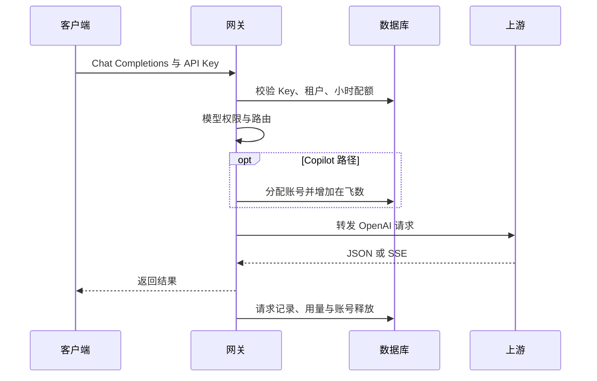

# OpenAI 对话代理

[返回文档索引](./README.md)

## 模块概述

提供 `POST /v1/chat/completions`，使支持 OpenAI Chat Completions 格式的客户端调用内部上游。网关检查租户权限，按模型选择提供商，支持非流式 JSON 与 SSE 流式结果。

实现入口为 [server.py](../backend/server.py) 的 `chat_completions()`，请求与响应适配位于 [proxy_core.py](../backend/proxy_core.py)。此模块不实现 Responses、Embeddings、文件上传或会话历史持久化。

## 数据结构 / Schema

没有独立聊天表。鉴权关联 [api_keys](./api_key_management.md)、[tenants](./tenant_management.md)，Copilot 请求使用 [accounts](./account_pool.md)；完成后写入 [request_log](./tenant_management.md) 和 [token_usage](./token_usage.md)。不会把请求正文写入上述表。

| 请求字段 | JSON 类型 | 默认值与行为 |
| --- | --- | --- |
| `model` | string | 缺失或为空时回填 `Qwen3.6-27B-VL` |
| `messages` | array of object | 原样透传；调用方应提供有效消息数组，网关不校验必填 |
| `stream` | boolean | 缺失时走非流式；上游请求中强制设为 `false` |
| `stream_options` | object | 流式时合并并强制 `include_usage: true` |
| `temperature`、`top_p`、`max_tokens` | number / integer | 无网关默认值，按原请求传递 |
| `tools`、`tool_choice`、其他字段 | 对应上游格式 | 透传，是否支持由上游决定 |

## API / 函数规格

| 方法 / 函数 | 参数 | 返回 |
| --- | --- | --- |
| `POST /v1/chat/completions` | API Key 请求头、上述 JSON body | 非流式上游 JSON，或 `text/event-stream` |
| `build_upstream_body_from_openai(body)` | `dict` | 浅拷贝 body，回填模型及流式用量选项 |
| `non_stream_openai_response(upstream_body, headers, model, url=None)` | 上游请求体、请求头、目标地址 | 上游 JSON；非 200 抛 `RuntimeError` |
| `stream_openai_response(upstream_body, headers, model, url=None, stats=None)` | 可选共享统计字典 | 异步 SSE 生成器；更新 `stats.total_tokens` |

请求示例（Key 使用 [鉴权规则](./api_key_management.md)）：

```http
POST /v1/chat/completions HTTP/1.1
Host: 127.0.0.1:9899
Authorization: Bearer <gateway-api-key>
Content-Type: application/json

{
  "model": "Qwen3.6-27B-VL",
  "messages": [{"role": "user", "content": "你好"}],
  "stream": false
}
```

非流式响应示例；字段由上游提供，网关不补齐固定结构：

```json
{
  "id": "chatcmpl-example",
  "object": "chat.completion",
  "model": "Qwen3.6-27B-VL",
  "choices": [{"index": 0, "message": {"role": "assistant", "content": "你好！"}, "finish_reason": "stop"}],
  "usage": {"prompt_tokens": 8, "completion_tokens": 3, "total_tokens": 11}
}
```

流式时设置 `stream: true`。网关注入用量选项，即使调用方传 `include_usage: false` 也会改为 `true`。响应头包括 `Cache-Control: no-cache`、`Connection: keep-alive`、`X-Accel-Buffering: no`。

```text
data: {"choices":[{"index":0,"delta":{"content":"你好"},"finish_reason":null}]}

data: {"choices":[],"usage":{"prompt_tokens":8,"completion_tokens":3,"total_tokens":11}}

```

SSE 解析器合并同一事件的多行 `data:`，忽略注释以及 `event:`、`id:`、`retry:`，也接受单行 JSON 和普通文本。JSON 重新序列化后发送，不是字节级透传；普通文本包装进 `choices[0].delta.content`。

## 业务流程图



图中的结果返回与记录先后为概括；非流式在返回 JSON 前记账，流式在生成器结束的 `finally` 中清理。

## 权限与安全

每次调用先执行 [API Key 校验](./api_key_management.md)，再验证租户模型权限。客户端 Header 不会整体透传到上游，上游使用网关生成的请求头；连接设置参见 [模型路由](./model_routing.md)。

项目没有数据库 RLS。SQL 表只存调用元数据，但上游错误响应可能进入日志及客户端错误内容。调试样例应使用脱敏消息和凭据。

## 边界条件与错误码

| HTTP 状态 / 情况 | 实际行为 | 排查建议 |
| --- | --- | --- |
| `401` / `403` / `429` | 缺失 Key、Key 或租户无效、模型禁止、小时配额超限 | 按 [鉴权](./api_key_management.md) 与 [租户](./tenant_management.md) 排查 |
| `503` | `No available accounts`，Copilot 没有启用账号 | 检查账号池 `is_active` |
| `500` | Copilot IAM / Header 构建失败，或未处理的 JSON/类型错误 | 检查 IAM、请求体与日志 |
| `502` | 非流式上游非 200、连接异常或响应处理失败 | 检查上游 URL、权限和 `UPSTREAM_TIMEOUT` |
| HTTP `200` 但流内含 `error` | 上游错误已经发生在 StreamingResponse 开始之后 | 客户端必须解析 SSE 错误内容 |
| 非流式 `usage` 缺失 | 用量记为 0；有效 JSON 未必满足响应处理器对对象的假设 | 核对真实上游响应结构 |

流式上游错误示例，之后发送 `data: [DONE]`：

```json
{"error":{"message":"Upstream error (503): unavailable","type":"upstream_error","code":503}}
```

> [!WARNING]
> 当前 `iter_upstream_sse()` 遇到 `[DONE]` 直接结束，不会把标记交给转发层，因此正常流通常没有最终 `data: [DONE]`。客户端需能处理 EOF；要求严格结束标记的接入应先验证。流内异常也可能被底层捕获并转成数据，导致账号清理层按成功记录，详见 [账号池](./account_pool.md)。
