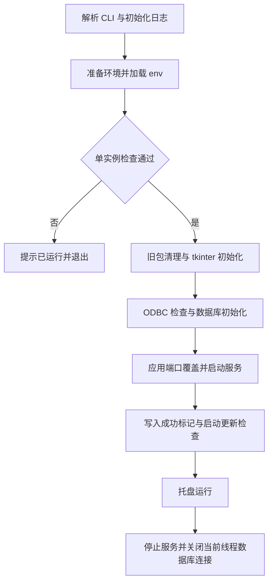

# 配置、启动与打包

[返回文档索引](./README.md)

## 模块概述

管理运行配置、ODBC 驱动准备、服务启动、Windows 托盘与单实例，以及前端和 exe 构建。入口为 [main.py](../main.py) / [backend/main.py](../backend/main.py)，打包入口为 [entry.py](../entry.py)，相关配置位于 [config.py](../backend/config.py)。

主要部署形态是本机 Windows 桌面网关，共享 SQL Server 数据库。监听地址固定为 `127.0.0.1`；没有 CLI host 参数或 Windows Service 安装逻辑。

## 数据结构 / Schema

本功能不新增表，启动会调用 [数据库初始化](./database.md) 创建或调整六张业务表。

| 运行数据 / 文件 | 类型 / 位置 | 含义 |
| --- | --- | --- |
| `.env` | 文本配置 | 上游、数据库和服务参数；默认在项目根目录 |
| `ServerRunner.server` | Uvicorn Server / None | 当前服务器对象 |
| `ServerRunner.thread` | daemon Thread / None | 后台服务线程 |
| `Global\LLM_API_Gateway_SingleInstance` | Windows 命名互斥体 | 单实例标识，不区分端口 |
| 应用数据目录 | `%APPDATA%\CopilotGateway` | 日志与更新成功标记；无 APPDATA 时回退用户 Roaming 目录 |
| `frontend/dist` | 静态文件目录 | Vite 构建产物 |
| `dist/LLM-API-Gateway.exe` | Windows 单文件程序 | PyInstaller 构建产物 |
| `file_version_info.txt` | 构建生成的版本资源 | 从 backend.__version__ 生成 |

### 环境变量

默认值依据 [config.py](../backend/config.py)；仓库只保留通用默认值，实际地址与凭据由本地 .env 提供。

| 变量 | 类型 | 默认 / 作用 |
| --- | --- | --- |
| `DB_DRIVER` | string | 未设时优先自动选择 ODBC 18，再 17，再其他 SQL Server ODBC；最终回退 17 |
| `DB_SERVER` | string | 默认 localhost,1433；部署时显式设置 |
| `DB_DATABASE` | string | 默认 gateway_dev；部署时显式设置 |
| `DB_UID` | string | 默认 `gateway_user`；实际使用已配置相应权限的数据库用户 |
| `DB_PWD` | string | 默认空；数据库密码 |
| `COPILOT_API_URL` | string | 默认空；Copilot HTTP 地址 |
| `TOKEN_API_URL` | string | 默认空；IAM 纯文本 Token 地址 |
| `APP_ID` | string | 默认 `com.example.gateway`，写入调用来源 Header |
| `UPSTREAM_AUTH_TYPE` | string | 默认 dynamic_token；实际支持 dynamic_token/none |
| `ZJ_API_URL` | string | 默认空；部署时显式设置 |
| `ZJ_API_KEY` | string | 默认空；ZJ Bearer 凭据 |
| `LOCAL_PORT` | int | 默认 9899 |
| `UPSTREAM_TIMEOUT` | float | 默认 300 秒；模型 HTTPX 超时 |
| `TOKEN_CACHE_TTL` | int | 默认 240 秒；IAM 缓存 |
| `SEED_ACCOUNTS_JSON` | JSON string | 默认 []；账号 ID 与显示名的二维数组，仅本地配置 |
| `DEFAULT_API_KEY` | string | 默认空；非空才创建种子 Key |
| `UPDATE_SHARE_PATH` | string | 默认空，禁用更新检查 |
| `UPDATE_CHECK_INTERVAL_HOURS` | int | 默认 24 小时；托盘周期更新通知 |
| `LOG_LEVEL` | string | configure_logging 未传 level 时使用；正常 CLI 显式传入 --log-level，见下文 |

操作系统环境还有 USERNAME（管理和计量身份）、APPDATA（Windows 数据目录），非 Windows 数据目录使用 XDG_CONFIG_HOME 或用户 `.config`。`prepare_runtime_environment()` 清空 HTTP_PROXY、HTTPS_PROXY、ALL_PROXY 并设置 NO_PROXY 为 `127.0.0.1,localhost`，随后 `.env` 加载仍可能覆盖同名变量。

### 配置文件优先级

源码模式只查项目根目录 `.env`。冻结模式先查 exe 同级 `.env`，不存在才读 PyInstaller 内嵌 `.env`。两份文件不合并；被选文件通过 `load_dotenv(..., override=True)` 覆盖已有同名进程环境变量。`--port` 在加载之后再覆盖 LOCAL_PORT。

## API / 函数规格

本模块没有独立管理 HTTP 路由。服务接口见 [健康检查](./observability.md)，程序控制使用以下入口：

| CLI / 函数 | 参数 | 返回 / 行为 |
| --- | --- | --- |
| `uv run python main.py` | 默认托盘模式 | main() 正常退出返回 0，部分启动失败返回 1 |
| `--port` | int，默认 0 表示不覆盖 | 临时设置监听端口 |
| `--log-level` | string，默认 INFO | 日志级别，未知值回退 INFO |
| `--no-tray` | boolean 开关 | 无托盘分支；当前有重复启动问题，见下文 |
| `--skip-update` | boolean 开关 | 跳过启动清理旧包和启动更新检查，不禁用托盘周期检查 |
| `ServerRunner.start()` | 无 | 后台线程运行服务；已存在线程且存活时直接返回 |
| `ServerRunner.run_blocking()` | 无 | 当前线程启动 Uvicorn 及清理定时器 |
| `ServerRunner.stop()` | 无 | 取消清理定时器，设置 should_exit，最多 join 3 秒 |
| `ensure_odbc_driver()` | 无 | bool；无驱动时尝试安装 driver 中的 MSI |

启动后可读取 `/health`，最小响应结构示例：

```json
{"status":"ok","listen":"http://127.0.0.1:9899","upstream":"https://copilot.example.invalid/v1/chat/completions","supported_models":["Qwen3.6-27B-VL","MiniMax-M2.7","Glm-5.1","GLM-V5"],"timestamp":1788480000}
```

### 开发环境准备

需要 Python 3.13、uv、Node.js/npm、SQL Server 可达性以及相应 ODBC 驱动。项目没有声明 Node engines 或 SQL Server 最低版本；Python 依赖有 [uv.lock](../uv.lock)，前端使用 [package-lock.json](../frontend/package-lock.json) 锁定公开 npm 源依赖。

从仓库根目录安装依赖：

```powershell
uv sync
```

创建自己的 `.env`，将下列占位值替换为独立开发配置；地址不是可直接访问的演示服务：

```dotenv
DB_SERVER=sqlserver.example.invalid,1433
DB_DATABASE=gateway_dev
DB_UID=gateway_dev_user
DB_PWD=replace-with-development-password
COPILOT_API_URL=https://copilot.example.invalid/v1/chat/completions
TOKEN_API_URL=https://iam.example.invalid/token
APP_ID=com.example.gateway.dev
UPSTREAM_AUTH_TYPE=dynamic_token
ZJ_API_URL=https://zj.example.invalid/v1/chat/completions
ZJ_API_KEY=replace-with-zj-key
LOCAL_PORT=9899
UPSTREAM_TIMEOUT=300
TOKEN_CACHE_TTL=240
DEFAULT_API_KEY=replace-with-unique-development-key
UPDATE_SHARE_PATH=
UPDATE_CHECK_INTERVAL_HOURS=24
```

源码开发时保持 UPDATE_SHARE_PATH 为空，避免执行面向 exe 的替换逻辑。启动：

```powershell
uv run python main.py --skip-update
```

按 [管理员首次授权](./admin_access.md) 配置 admin_users。前端在另一个终端运行，开发页面地址为 `http://localhost:3000`：

```powershell
Set-Location frontend
npm install
npm run dev
```

若使用后端 `/admin/` 直接访问页面，先在 frontend 目录执行 `npm run build`。端口改动时同步修改 Vite 代理配置。

### 打包与发版

在根目录安装可选构建依赖，再运行脚本：

```powershell
.\build.bat
```

或执行手动步骤：

```powershell
Set-Location frontend
npm install
npm run build
Set-Location ..
uv run --extra build pyinstaller copilot_proxy.spec --noconfirm --clean
```

Spec 将 `frontend/dist` 映射到内嵌 frontend，同时内嵌 `.env`、driver 目录；设置 `console=False`，输出单文件 exe。构建需从项目根目录运行，因为 Spec 基于当前工作目录解析输入。

发版时修改 [backend/__init__.py](../backend/__init__.py) 的 `__version__`，采用数值 `major.minor.patch`；构建后核对 exe FileVersion。随后在隔离目标机验证 `/health`、管理界面及相关上游路径，再将验证后的 exe 放入既定更新共享目录。更新行为见 [自动更新](./auto_update.md)。

## 业务流程图



托盘菜单包括管理界面、打开日志、运行地址、版本、检查更新和关闭服务。重复运行同一主机上的其他端口实例也会被同名全局互斥体拒绝。

## 权限与安全

`.env` 已被 [.gitignore](../.gitignore) 忽略，但打包会把它嵌入 exe；可分发程序的持有人可能提取内嵌配置。构建前应核对其中凭据的授权范围。不得把本机 `.env` 的真实内容写进文档或提交。

驱动自动安装使用 `msiexec /i ... /quiet /norestart IACCEPTMSODBCSQLLICENSETERMS=YES`，超时 120 秒；可能需要 Windows 管理员权限。代码只把退出码 0 认定为成功，其他退出码会进入失败流程。数据库、更新共享目录与 exe 所在目录的权限另见对应文档。

## 边界条件与错误码

| 情况 | 实际行为 / 排查 |
| --- | --- |
| 重复启动 | Windows 提示服务已运行，返回 0；非 Windows 跳过互斥体 |
| 缺少 ODBC 且自动安装失败 | 提示以管理员身份运行，返回 1 |
| 数据库初始化异常 | 弹窗并记录日志，返回 1；检查配置与 DDL 权限 |
| `.env` 中 LOG_LEVEL 不生效 | 日志在 load_env 前配置，且 CLI 默认传 INFO；使用 --log-level |
| 端口占用 | 服务线程可能启动失败；当前只检查 runner.server 对象是否非空，不验证端口已绑定 |
| `--no-tray` | 先 runner.start 后再次 run_blocking，可能重复绑定；并且仍使用 tkinter 弹窗，不是完整无界面模式 |
| pystray 导入失败 | 回退 run_blocking，同样可能遇到重复启动问题 |
| 开发环境不是 Windows 桌面 | 虽有部分非 Windows 回退，主入口 tkinter、更新 Win32 API 与日志打开仍有平台依赖 |
| build.bat 构建失败 | 脚本检查各步骤退出码并返回非零；可使用 --no-pause 自动化运行 |

2026-09-05 本地验证：uv 创建 .venv 并安装构建依赖；build.bat --no-pause 完成前端和 exe 构建；ASGI 冒烟检查确认 /health 与 /admin/ 返回 200、缺少 Key 的对话请求返回 401。本机 ODBC 驱动自动安装返回 1603，因此未完成真实数据库及上游联调。
