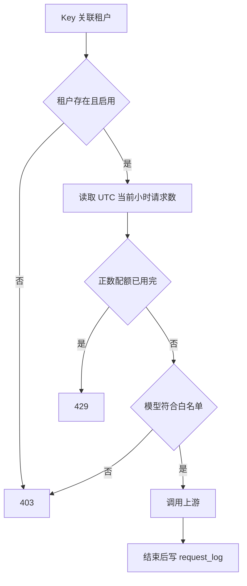

# 租户与配额管理

[返回文档索引](./README.md)

## 模块概述

为团队或项目划分 API Key、允许模型与小时请求配额。管理入口位于 [admin_api.py](../backend/admin_api.py)，鉴权与限制检查位于 [server.py](../backend/server.py)，数据库实现位于 [db.py](../backend/db.py)。

租户隔离是应用层的调用权限与用量归属，不隔离 Copilot 上游账号，不提供租户专属管理后台。

## 数据结构 / Schema

| `tenants` 字段 | SQL Server 类型 | 含义 / 默认值 |
| --- | --- | --- |
| `tenant_id` | `NVARCHAR(64)` PK | 创建时由名称转换得到 |
| `name` | `NVARCHAR(128) NOT NULL` | 展示名称 |
| `quota_limit` | `INT NOT NULL DEFAULT -1` | 小时请求上限；只有正数启用限制 |
| `allowed_models` | `NVARCHAR(MAX) NULL` | JSON 字符串数组；NULL / 空数组在应用中表示全部 |
| `is_active` | `BIT NOT NULL DEFAULT 1` | 租户启用状态 |
| `daily_tokens`、`monthly_tokens`、`yearly_tokens` | 各为 `BIGINT NOT NULL DEFAULT 0` | 日、月、年缓存计数 |
| `tokens_reset_date` | `DATETIME2 NULL` | 最近一次正 Token 写入时间 |

| `request_log` 字段 | SQL Server 类型 | 含义 |
| --- | --- | --- |
| `id` | `BIGINT IDENTITY(1,1)` PK | 自增记录 ID |
| `tenant_id` | `NVARCHAR(64) NOT NULL` | 逻辑租户关联，无外键 |
| `model` | `NVARCHAR(128) NULL` | 请求模型 |
| `created_at` | `DATETIME2 NOT NULL DEFAULT GETUTCDATE()` | 记录写入时间，通常是请求结束时刻 |

配额查询索引为 `ix_request_log_tenant_created(tenant_id, created_at)`。请求日志不保存成功状态、延迟、HTTP 码或 Token；不是完整审计流水。

## API / 函数规格

| 方法 / 路由 | 参数 | 响应 |
| --- | --- | --- |
| `GET /admin/tenants` | 无 | 租户数组 |
| `POST /admin/tenants` | `name: string` 默认空；`quota_limit: int` 默认 -1；`allowed_models: string[] / null` | `{"tenant_id":"alpha-team"}` |
| `PUT /admin/tenants/{tenant_id}` | 可选 name、quota_limit、allowed_models | `{"status":"updated"}` |
| `DELETE /admin/tenants/{tenant_id}` | 路径 tenant_id，无 body | `{"status":"deleted"}` |

创建示例：

```json
{"name":"Alpha Team","quota_limit":120,"allowed_models":["GLM-V5","MiniMax-M2.7"]}
```

`tenant_id = name.lower().replace(' ', '-')`，因此示例结果为 `alpha-team`。没有完整 slug 清理或随机后缀；相同 ID 再次创建时保持旧行，不覆盖配置，也不返回 409。更新 name 不改变 tenant_id。

列表响应示例（用量均为零的新租户）：

```json
[{"tenant_id":"alpha-team","name":"Alpha Team","quota_limit":120,"allowed_models":["GLM-V5","MiniMax-M2.7"],"is_active":true,"daily_tokens":0,"monthly_tokens":0,"yearly_tokens":0}]
```

PUT 是部分更新语义：字段缺失或 `null` 表示不修改。解除模型限制必须传空数组：

```json
{"allowed_models":[]}
```

| 内部函数 / 结构 | 规格 |
| --- | --- |
| `create_tenant(name, quota_limit=-1, allowed_models=None)` | 返回生成的 tenant_id |
| `update_tenant(tenant_id, quota_limit=None, allowed_models=None, name=None)` | 仅更新非 None 字段，返回 None |
| `get_tenant_hourly_usage(tenant_id)` | 返回当前 UTC 自然小时的 request_log 行数 |
| `log_request(tenant_id, model=None)` | 写入一条配额记录 |
| `TenantContext` | 包含 tenant_id、tenant_name、allowed_models、quota_limit、current_usage |

### 配额与模型规则

小时边界按 SQL Server UTC 的年/月/日/小时相同判断，既不是滚动 60 分钟，也不是用户当地自然小时。仅当 `quota_limit > 0` 且用量达到上限才拒绝；`-1` 是约定的无限值，当前 `0` 或其他负数也不会限流。

配额在鉴权时读取，请求日志在上游处理完成或流结束时写入；已进入处理器的上游失败也通常记一条。鉴权失败、禁止模型、无账号、Copilot Header 构建失败不会记入。模型查询受配额限制但不增加用量。并发请求没有原子预占，可能同时通过剩余配额。

## 业务流程图



## 权限与安全

管理接口全部要求 [管理员身份](./admin_access.md)，其权限覆盖所有租户。推理请求不能通过 body 自行指定租户，租户从 API Key 所属关系确定。

没有 SQL Server RLS、租户外键或 JSON Schema 约束。`allowed_models` 不验证是否在支持列表中，但应用侧比对区分大小写。`is_active` 存在于表中且会参与鉴权，当前 CRUD API 不提供修改它的字段。

删除租户时同一数据库事务先删除该租户 Key，再删除租户本身；保留 `request_log` 与 `token_usage`。同名重建会复用 ID，可能重新关联历史记录；删除 default 后，下次数据库初始化又会补回默认租户和种子 Key。

## 边界条件与错误码

| 情况 | 实际结果 / 排查 |
| --- | --- |
| 非管理员访问 | HTTP 403 |
| 租户失效或不存在 | 推理鉴权返回 `403 Tenant inactive or not found` |
| 配额超限 | `429 Quota exceeded`；没有 Retry-After 或配额 Header |
| 模型禁止 | 403；核对大小写和白名单 JSON |
| 更新 / 删除不存在的租户 | 仍返回 200，不验证受影响行数 |
| 名称为空、过长、含路径字符 | 没有专门校验，可能生成空 ID、不可用路径或数据库错误 |
| 表内 allowed_models 不是合法 JSON | 读取时 json.loads 失败，可能产生 500 |

> [!NOTE]
> 当前 `list_tenants()` 的 Token 字段下标错位：`monthly_tokens` 读取日用量，`yearly_tokens` 因索引长度判断而返回 0。`get_tenant()` 的映射正确。[Token 汇总接口](./token_usage.md) 从明细聚合，可用于核对。前端清空模型输入框发送的是 null，不能解除限制；需要直接 PUT `[]`。
