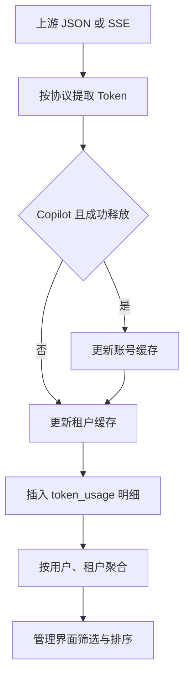

# Token 用量统计

[返回文档索引](./README.md)

## 模块概述

记录每次请求的 Token 明细，按网关进程账号和租户汇总日、月、年消耗，并可按模型筛选。Copilot 另更新上游账号累计值，两个提供商都更新租户累计值。

记账编排位于 [server.py](../backend/server.py)，数据库聚合位于 [db.py](../backend/db.py)，查询接口位于 [admin_api.py](../backend/admin_api.py)，交互位于 [TokenUsagePanel.vue](../frontend/src/components/TokenUsagePanel.vue)。

## 数据结构 / Schema

| `token_usage` 字段 | SQL Server 类型 | 含义 |
| --- | --- | --- |
| `id` | `BIGINT IDENTITY(1,1)` PK | 明细行 ID |
| `user_account` | `NVARCHAR(128) NOT NULL` | 网关进程的 Windows 账号 |
| `tenant_id` | `NVARCHAR(64) NOT NULL` | Key 对应租户，无外键 |
| `model` | `NVARCHAR(128) NULL` | 请求模型 |
| `token_count` | `BIGINT NOT NULL DEFAULT 0` | 本次记录的总 Token |
| `created_at` | `DATETIME2 NOT NULL DEFAULT GETUTCDATE()` | UTC 写入时间 |

索引：`ix_token_usage_account_tenant_model(user_account, tenant_id, model, created_at)`。关联 [accounts](./account_pool.md) 与 [tenants](./tenant_management.md) 的 `daily_tokens`、`monthly_tokens`、`yearly_tokens`、`tokens_reset_date` 缓存计数。

`user_account` 不是 Copilot 的 account_id，也不是远端客户端的登录用户。同一网关进程发出的所有请求通常共享这个值。

## API / 函数规格

| 方法 / 函数 | 参数 | 返回 |
| --- | --- | --- |
| `GET /admin/token-usage` | 可选 query `model: string` | 按用户与租户聚合的数组 |
| `log_token_usage(user_account, tenant_id, token_count, model=None)` | 含 0 的整数用量 | 插入明细，返回 None |
| `get_token_usage_summary(model=None)` | 可选模型字符串 | 日/月/年汇总列表 |
| `add_token_usage(account_id, token_count)` | Copilot 上游账号与数量 | 正数才更新账号缓存 |
| `add_tenant_token_usage(tenant_id, token_count)` | 租户与数量 | 正数才更新租户缓存 |

调用 `/admin/token-usage?model=GLM-V5` 的响应示例：

```json
[
  {
    "user_account":"demo_user",
    "tenant_id":"alpha-team",
    "tenant_name":"Alpha Team",
    "daily_tokens":110,
    "monthly_tokens":1500,
    "yearly_tokens":20000
  }
]
```

响应没有 `model` 字段。未筛选时把各模型合并；筛选后仍按 `user_account + tenant_id` 分组。租户已删除时 `tenant_name` 回退为 tenant_id。没有数据时返回 `[]`。

数据库按 UTC 日期、月份和年份计算当前周期，没有历史时间区间参数。仅有历史用量的用户/租户组合也可返回当前周期全零行；默认按账号及租户 ID 排序。搜索账号、Token 排序由前端完成，服务端没有分页、排序或账号过滤参数。

### 计量来源

| 协议与模式 | Token 来源 | 当前限制 |
| --- | --- | --- |
| OpenAI 非流式 | 上游 `usage.total_tokens` | 缺失为 0；不自动用 prompt + completion 补算 |
| OpenAI 流式 | 最后收到的正 `usage.total_tokens` | 不是把每块累加；依赖上游支持 include_usage |
| Anthropic 非流式 | 转换后的 input_tokens + output_tokens | 分别来自 prompt_tokens、completion_tokens |
| Anthropic 流式 | 0 | 没有统计连接，响应 usage 也为 0 |

正常非流式请求成功时写入明细；上游异常分支通常只写 request_log。流式生成器在结束的 finally 中写入明细，即使用量为 0。账号、租户缓存和明细各自提交，不是单个记账事务；中途数据库失败可能出现部分写入。

## 业务流程图



## 权限与安全

查询接口要求 [本机管理员](./admin_access.md)，可查看所有租户，不是租户自助接口。数据库没有 RLS。明细存账号、租户、模型、总量与时间，不存聊天正文、输入输出 Token 拆分或费用。

此统计未实现计费账本、去重 ID、补偿重试或账单金额换算，不宜把聚合值直接当作完整的供应商计费凭证。

## 边界条件与错误码

| 情况 | 当前结果 / 排查 |
| --- | --- |
| 非管理员 | HTTP 403 |
| 数据库查询失败 | HTTP 500，检查连接、表结构及索引 |
| model 参数无匹配数据 | 200 `[]`，不报未知模型 |
| Anthropic 流式显示 0 | 当前实现限制，应对照上游计量 |
| 跨 UTC 零点后账号面板仍显示昨日值 | 缓存只在下一次正 Token 写入时重置；聚合接口按当前日期计算 |
| 租户列表月/年数字不符 | `list_tenants()` 存在字段映射错误，见 [租户管理](./tenant_management.md) |
| 客户端断开或流式中途失败 | 最终 usage 可能尚未收到，记录可能低于真实消耗 |

`request_log` 有清理逻辑，`token_usage` 当前没有自动保留期或归档功能。长期运行时需单独规划明细增长管理。
