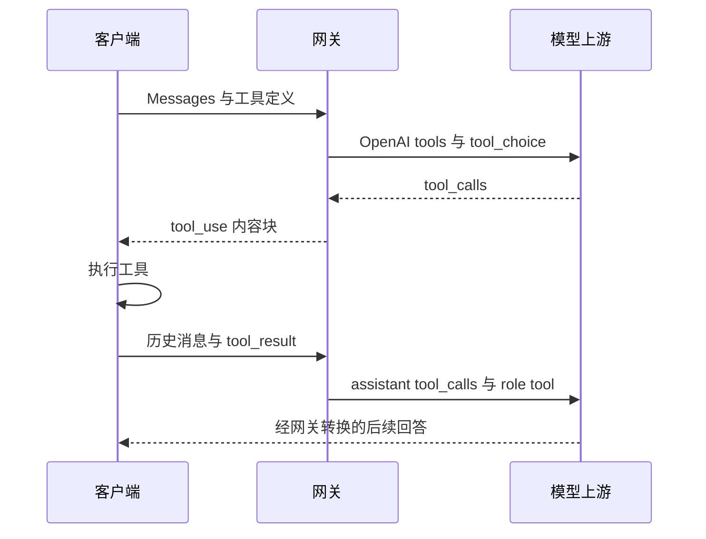

# 工具调用转换

[返回文档索引](./README.md)

## 模块概述

在 [Anthropic Messages](./anthropic_messages.md) 与上游 OpenAI function calling 之间转换工具定义、选择策略、调用请求和工具结果。实现集中在 [proxy_core.py](../backend/proxy_core.py)。OpenAI 接口的工具字段直接透传。

网关只转换协议。真正执行工具并把执行结果补回消息历史的是客户端；服务端没有工具注册表、沙箱或自动执行循环。

## 数据结构 / Schema

无独立数据库表，工具定义和参数只存在于请求/响应内存结构。

| Anthropic 字段 | 类型 | OpenAI 对应字段 / 行为 |
| --- | --- | --- |
| `tools[].name` | string | `tools[].function.name`；缺失名称的定义跳过 |
| `tools[].description` | string | `function.description`，缺失默认空字符串 |
| `tools[].input_schema` | object | `function.parameters`；空值默认空 object schema |
| assistant `tool_use.id` | string | `tool_calls[].id`；缺失生成 `call_` 加 16 位 UUID 十六进制片段 |
| assistant `tool_use.name` | string | `tool_calls[].function.name` |
| assistant `tool_use.input` | object | JSON 序列化为 `function.arguments` 字符串 |
| user `tool_result.tool_use_id` | string | 独立 `role: tool` 消息的 `tool_call_id` |
| user `tool_result.content` | string / array / object | 文本、换行拼接的文本或序列化 JSON |

流式转换按上游 `tool_calls[].index` 维护状态：

| 内存字段 | Python 类型 | 说明 |
| --- | --- | --- |
| `block_index` | int | 分配给 Anthropic 内容块的索引 |
| `id`、`name` | str | 调用 ID 与累计函数名 |
| `started`、`id_locked` | bool | 是否已发送 start、是否锁定已公布的 ID |
| `args_buf` | str | start 后累计的参数片段，不做完整 JSON 校验 |

## API / 函数规格

无独立 HTTP 路由。由 `POST /v1/messages`、`POST /messages` 触发转换。

| 函数 | 输入 | 返回 |
| --- | --- | --- |
| `convert_anthropic_tools_to_openai(tools)` | 任意值，预期 list | OpenAI 工具数组，非法容器返回 `[]` |
| `convert_anthropic_tool_choice_to_openai(tool_choice)` | dict | 字符串、指定函数对象或 `None` |
| `convert_anthropic_messages_to_openai_full(body)` | Messages body | 包含 assistant/tool 消息的数组 |
| `map_openai_finish_to_anthropic_stop(finish_reason)` | string / None | Anthropic 停止原因 |

| Anthropic `tool_choice` | OpenAI 结果 |
| --- | --- |
| `{"type":"auto"}` | `"auto"` |
| `{"type":"any"}` | `"required"` |
| `{"type":"tool","name":"lookup"}` | `{"type":"function","function":{"name":"lookup"}}` |
| `{"type":"none"}` | `"none"` |
| 无效或未提供 | 有有效 tools 时回退为 `"auto"`；无 tools 时不设置 |

完整请求示例：

```json
{
  "model": "GLM-V5",
  "max_tokens": 256,
  "stream": false,
  "messages": [{"role":"user","content":"查询工单 T-1"}],
  "tools": [{"name":"lookup_ticket","description":"查询工单","input_schema":{"type":"object","properties":{"id":{"type":"string"}},"required":["id"]}}],
  "tool_choice": {"type":"tool","name":"lookup_ticket"}
}
```

消息响应示例：

```json
{
  "id": "msg_0123456789abcdef01234567",
  "type": "message",
  "role": "assistant",
  "model": "GLM-V5",
  "content": [{"type":"tool_use","id":"call_example","name":"lookup_ticket","input":{"id":"T-1"}}],
  "stop_reason": "tool_use",
  "stop_sequence": null,
  "usage": {"input_tokens":32,"output_tokens":15}
}
```

客户端执行工具后，将以上 assistant content 保留在历史中，再加入下列 user 消息：

```json
{"role":"user","content":[{"type":"tool_result","tool_use_id":"call_example","content":"工单状态：处理中"}]}
```

转换后的该条上游消息为：

```json
{"role":"tool","tool_call_id":"call_example","content":"工单状态：处理中"}
```

## 业务流程图



## 权限与安全

沿用对话 API 的 Key、租户配额及模型权限。网关不会根据 JSON Schema 校验工具输入，也不会授权或限制客户端的工具操作。调用方应在执行端验证工具名、参数和目标资源权限。

没有新增环境变量或数据库 RLS。不要把实际执行凭据放进 `tools.description` 或返回消息中，这些内容会发送到模型上游。

## 边界条件与错误码

| 情况 | 当前结果 / 排查 |
| --- | --- |
| 工具调用前的 HTTP 错误 | 沿用 [Messages 错误码](./anthropic_messages.md)，没有独立工具错误码 |
| `tool_result` 没有 ID | 转换成空 `tool_call_id`，由上游决定是否拒绝 |
| 工具结果混合用户文本 | 用户文本先合成一条 user 消息，再追加 tool 消息，原块顺序不完全保留 |
| `is_error`、并行调用限制等扩展字段 | 未映射，不应依赖 |
| 非流式上游参数不是合法 JSON | 包装为 `{"_raw":原值}`；有效 JSON 非对象则包装为 `{"value":原值}` |
| 流式参数先于函数名到达 | 工具块尚未 start 时的参数片段不会缓存，可能丢失 |
| 上游重复发送完整函数名 | 当前按片段拼接，可能造成名称重复，需要核对真实分片方式 |

有工具调用时，最终 `stop_reason` 为 `tool_use`。流式 ID 在 content_block_start 后锁定，随后到达的新 ID 不再替换，避免客户端引用前后不一致。
